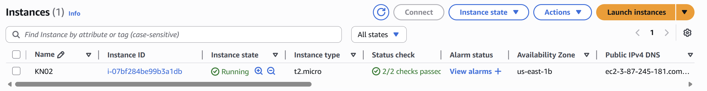

# KN02: AWS Instanz erstellen

## Instanz-Daten (Aufzählung)
Die erstellte Instanz (t2.micro) weist folgende Spezifikationen auf:

* **Diskgrösse:** 8 GiB
* **Betriebssystem:** Ubuntu 24.04 LTS
* **Grösse des RAM:** 1 GiB
* **Anzahl der CPUs:** 1 vCPU

---

## Screenshot der Instanz
Hier ist der Screenshot der Instanz-Liste inklusive der Details und der öffentlichen IP:

