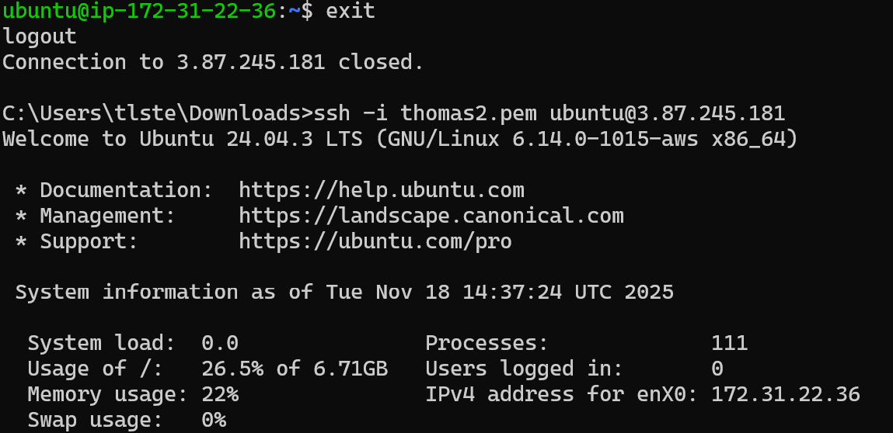
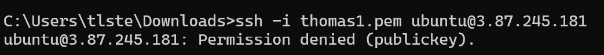
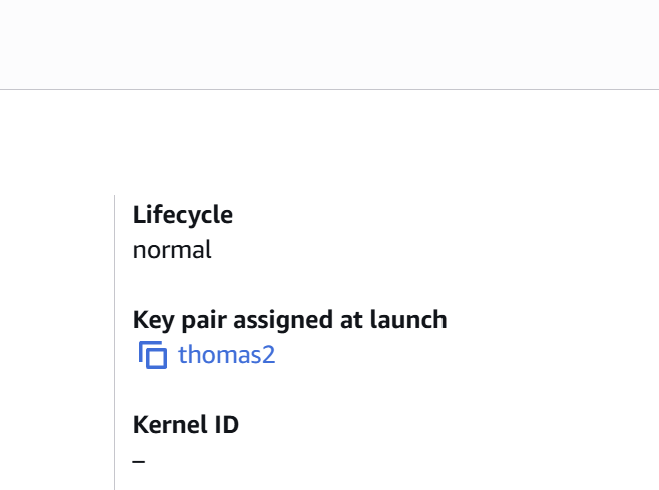

# KN02-B

## Instanz-Daten (Aufzählung)
Die erstellte Instanz (t2.micro) weist folgende Spezifikationen auf:

* **Diskgrösse:** 8 GiB
* **Betriebssystem:** Ubuntu 24.04 LTS
* **Grösse des RAM:** 1 GiB
* **Anzahl der CPUs:** 1 vCPU

---

## Screenshot der Instanz
Hier ist der Screenshot der Instanz-Liste inklusive der Details und der öffentlichen IP:

## KN02-C

### 1. Funktionsweise
Ich habe mich in das Public-Key-Verfahren eingelesen. Der Server besitzt den öffentlichen Schlüssel (Public Key), während ich den privaten Schlüssel (Private Key) besitze. Eine Verbindung ist nur möglich, wenn beide zusammenpassen.

### 2. Erfolgreicher Zugriff
Ich habe mich mit dem Schlüssel `thomas2.pem` verbunden. Da dieser Schlüssel beim Erstellen der Instanz hinterlegt wurde, war der Login erfolgreich.

*Successfuly Login with thomas2.pem*

---

### 3. Fehlgeschlagener Zugriff
Anschliessend habe ich versucht, mich mit `thomas1.pem` zu verbinden. Da dieser Schlüssel nicht auf dem Server hinterlegt ist, wurde der Zugriff verweigert ("Permission denied").

*Permission denied Login with thomas1.pem*

---

### 4. Überprüfung in der AWS Konsole
Ein Blick in die Instanz-Details bestätigt, dass der Instanz der Key `thomas2` zugewiesen ist. Das erklärt das Verhalten in den vorherigen Schritten.

*Instanz-Details with Key thomas2*