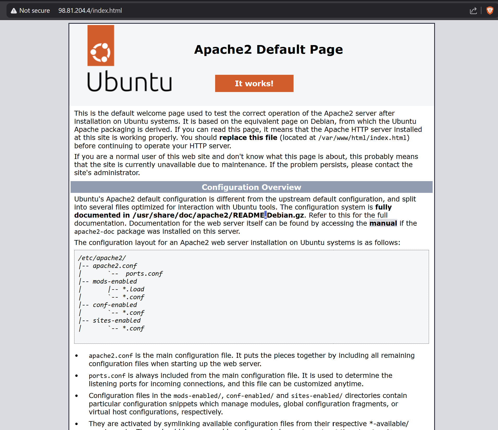
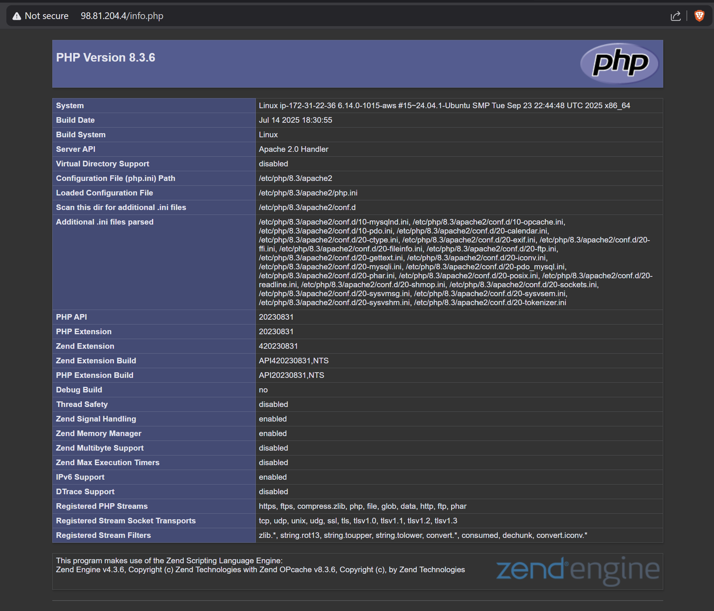
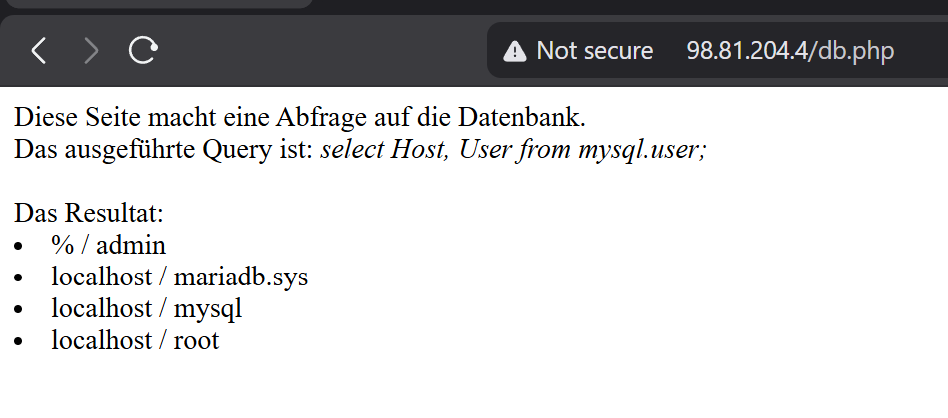
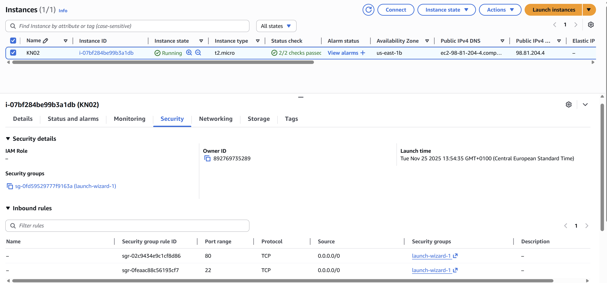
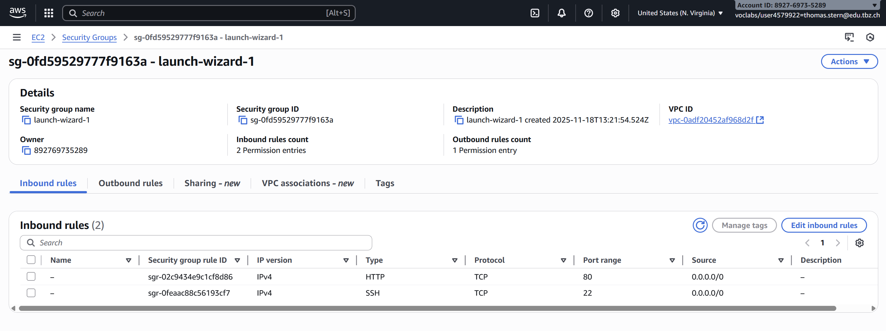
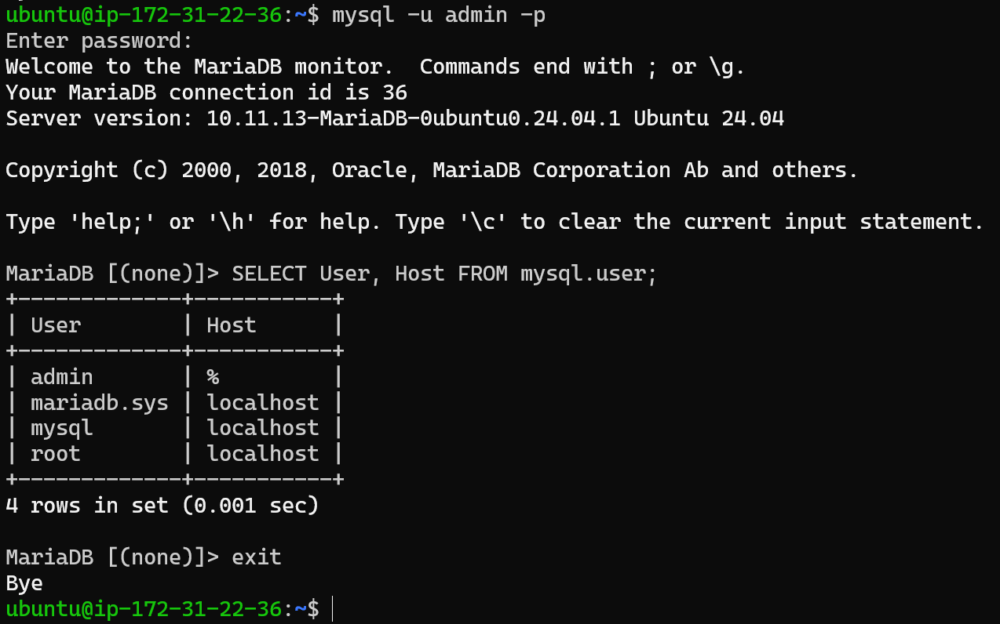

# KN03 Abgabe

## A) Installation von Web- und Datenbankserver

### Funktionierende Webseiten

**Apache2 Startseite (index.html):**

**PHP Info Seite (info.php):**

**Datenbank Test Seite (db.php):**

### Instanz Details
**Details der Instanz mit öffentlicher IP:**

### Sicherheitsgruppen
**Regeln der Sicherheitsgruppe:**

### MySQL Konsole
**Login und Abfrage in der Konsole:**

### Erklärung der SQL-Abfrage
Die ausgeführte SQL-Abfrage (typischerweise `SELECT User, Host FROM mysql.user;`) liest spezifische Informationen aus der Systemdatenbank von MySQL aus.
*   **SELECT User, Host**: Wählt die Spalten für den Benutzernamen und den zugehörigen Host aus.
*   **FROM mysql.user**: Gibt an, dass diese Daten aus der Tabelle `user` innerhalb der Datenbank `mysql` stammen.

Das Ergebnis zeigt eine Liste aller existierenden Datenbankbenutzer und von welchen Hosts (`localhost` oder `%` für alle) diese sich verbinden dürfen.
