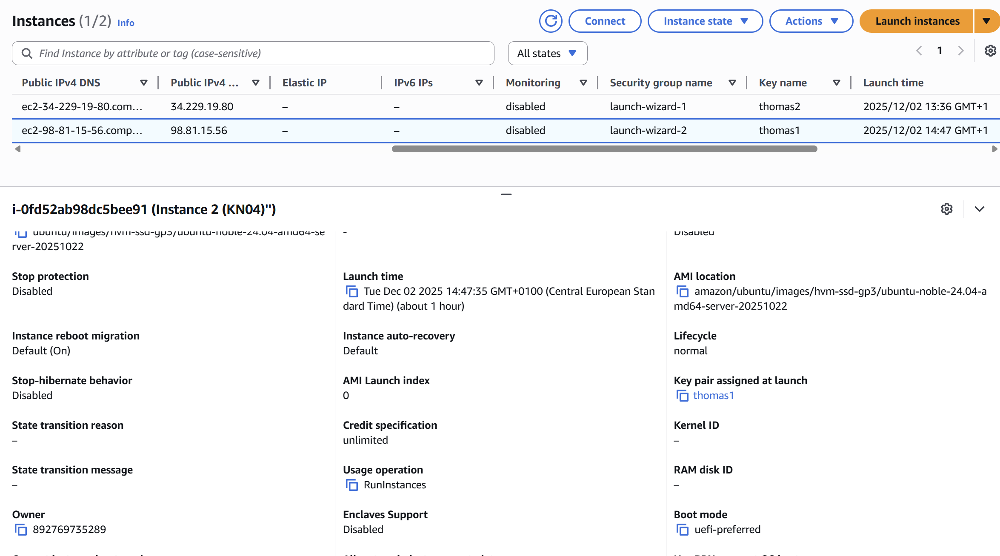
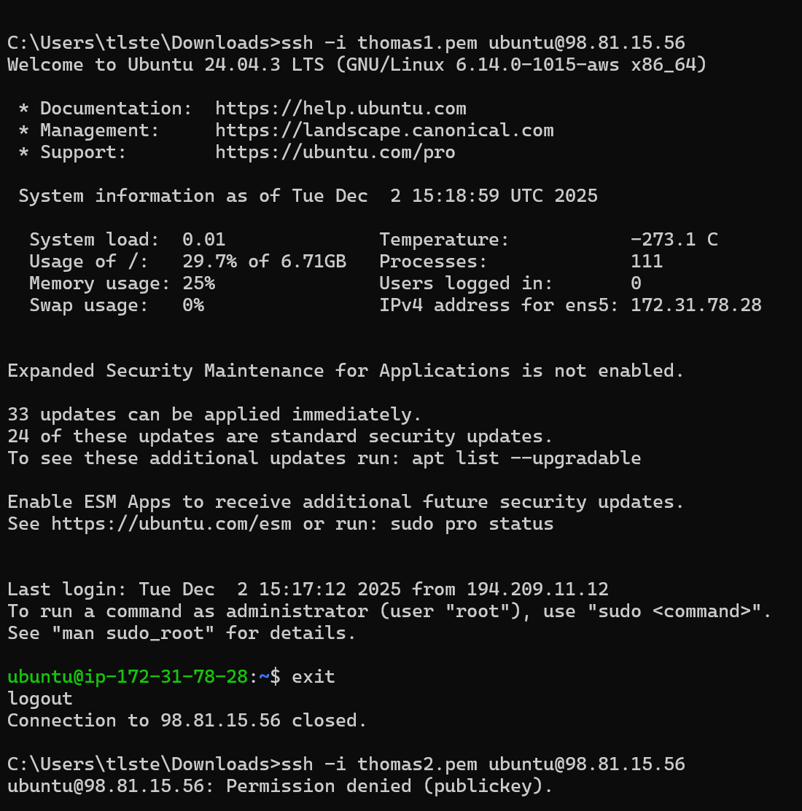
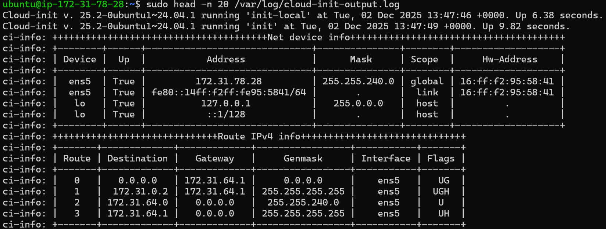
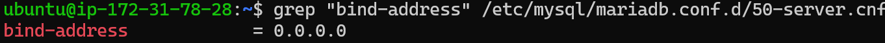
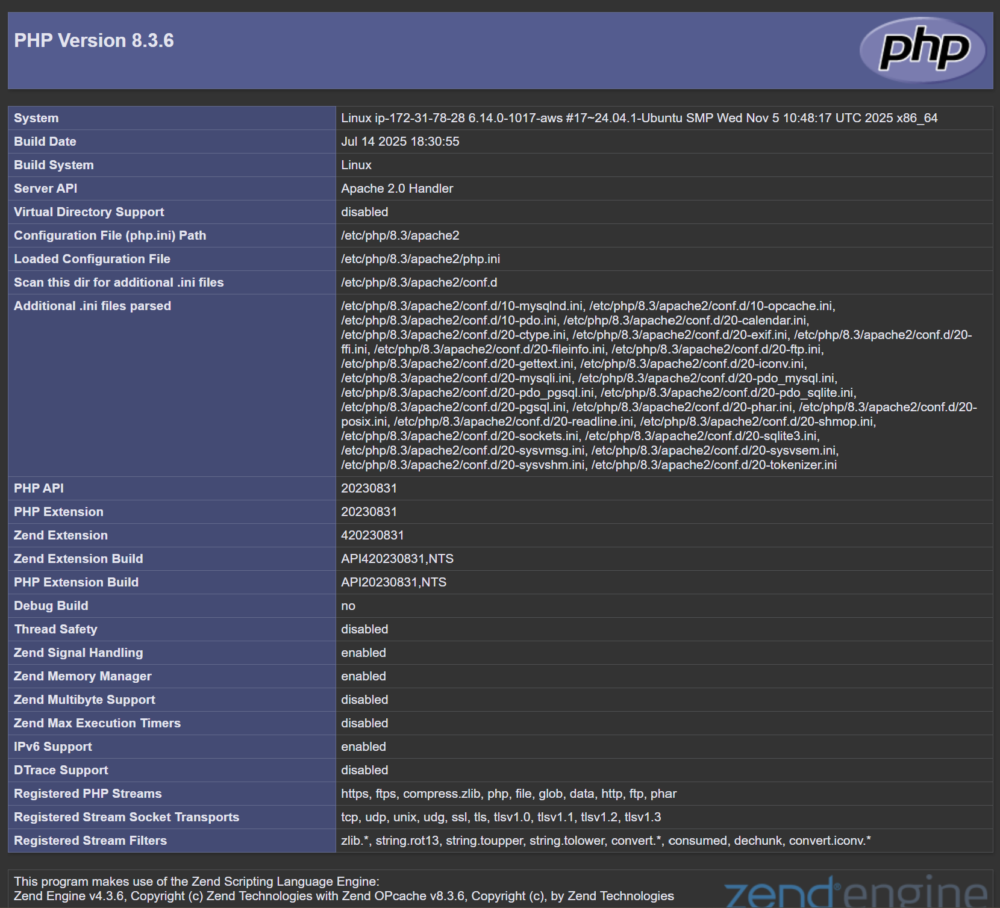
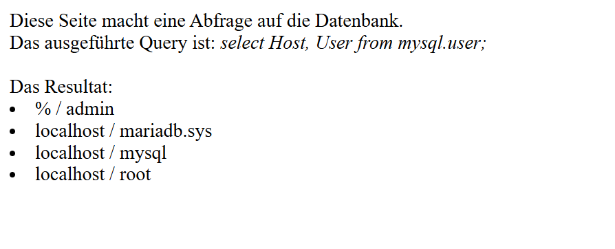
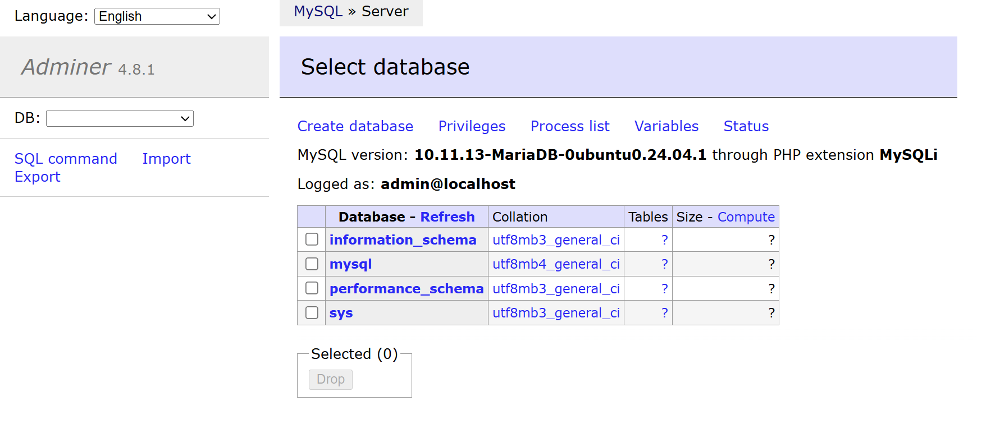

# KN04: Cloud-init und AWS

## A) Cloud-init Datei Verstehen

```yaml
#cloud-config                     
users:                             # Benutzer
  - name: ubuntu                   # Nutzername
    groups: [users, admin]         # Gruppen
    shell: /bin/bash               # Shell
    sudo: ALL=(ALL) NOPASSWD:ALL   # Passwortloses sudo
    ssh_authorized_keys:           # SSH-Keys
      - ssh-rsa AAAAB3NzaC1yc2EAAAADAQABAAABAQDFXIHcTfrSBc8o/MF5atl7irxyIDDsBqwHTzvQGli5xieWO0A+8mGH6EB8xlMXeb2kNm33DBSWQFz0P4byg2Tch3IXf5ADj+FQdLKBDHohFAAs6rSdJk3psd1M11Pyd9GWE/qVTbTL4/ic5oOK+C+XZtN7XnzagTHxpgYPMghMl4FY/XjZ02lxKmbCuLiMUCyt7/BLI3dkSAaU61XplDWH+XhmoFPo+SR5idQGhf+dguN1RIXGqGcmiC6o08bUcVXTo4W0GlFdEtGWV6bRWsNYP3eBTN2r6V2UmO6MfraCzKmhKv79+GLtIk5kEnxLe2GoULLpmh2H3bAgmXVbaSYt aws-key
      - ssh-rsa AAAAB3NzaC1yc2EAAAADAQABAAABAQC0WGP1EZykEtv5YGC9nMiPFW3U3DmZNzKFO5nEu6uozEHh4jLZzPNHSrfFTuQ2GnRDSt+XbOtTLdcj26+iPNiFoFha42aCIzYjt6V8Z+SQ9pzF4jPPzxwXfDdkEWylgoNnZ+4MG1lNFqa8aO7F62tX0Yj5khjC0Bs7Mb2cHLx1XZaxJV6qSaulDuBbLYe8QUZXkMc7wmob3PM0kflfolR3LE7LResIHWa4j4FL6r5cQmFlDU2BDPpKMFMGUfRSFiUtaWBNXFOWHQBC2+uKmuMPYP4vJC9sBgqMvPN/X2KyemqdMvdKXnCfrzadHuSSJYEzD64Cve5Zl9yVvY4AqyBD teacher-NUY

ssh_pwauth: false                  # Kein Passwort-Login
disable_root: false                # Root erlaubt
package_update: true               # apt update
packages:                          # Pakete installieren
  - curl                           # curl
  - wget                           # wget

```

- [cloud-init.yaml](cloud-init.yaml)

## B) SSH-Key und Cloud-init

**Cloud-init Konfiguration:**
- [cloud-init.yaml](cloud-init.yaml)

**Details der Instanz (Key pair assigned):**


**SSH Login mit erstem und zweitem Schlüssel:**


**Auszug aus dem Cloud-Init Log:**


## D) Installation automatisieren

**Cloud-init Datei:**
- [cloud-init-db.yaml](cloud-init-db.yaml)

**Überprüfung der Konfiguration (Grep Command):**


**Cloud-init Datei:**
- [cloud-init-web.yaml](cloud-init-web.yaml)

**Websites**

*Index.html (Apache Website):*


*Info.php:*


*DB Connection Test (db.php):*


**Adminer Interface:**

