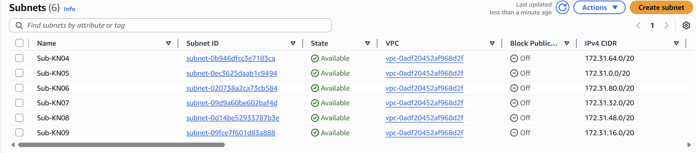
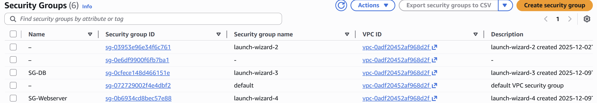
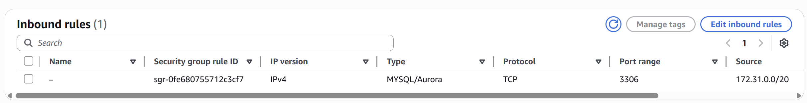
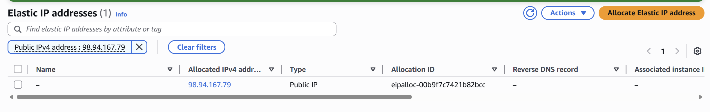
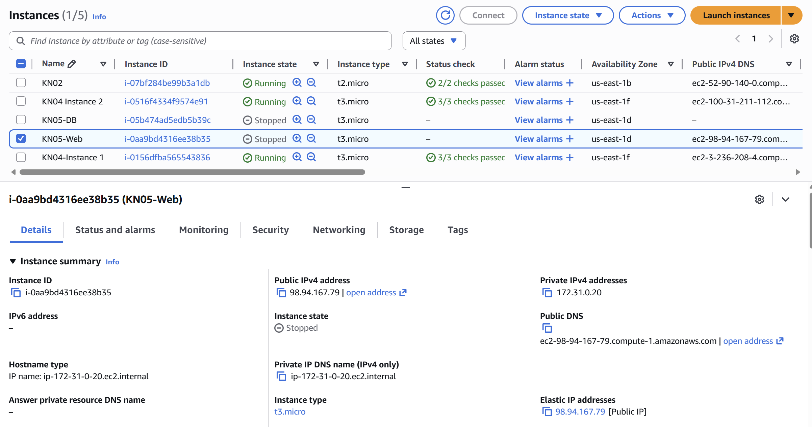
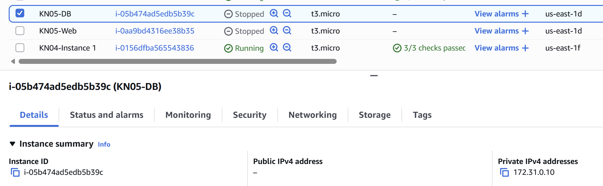
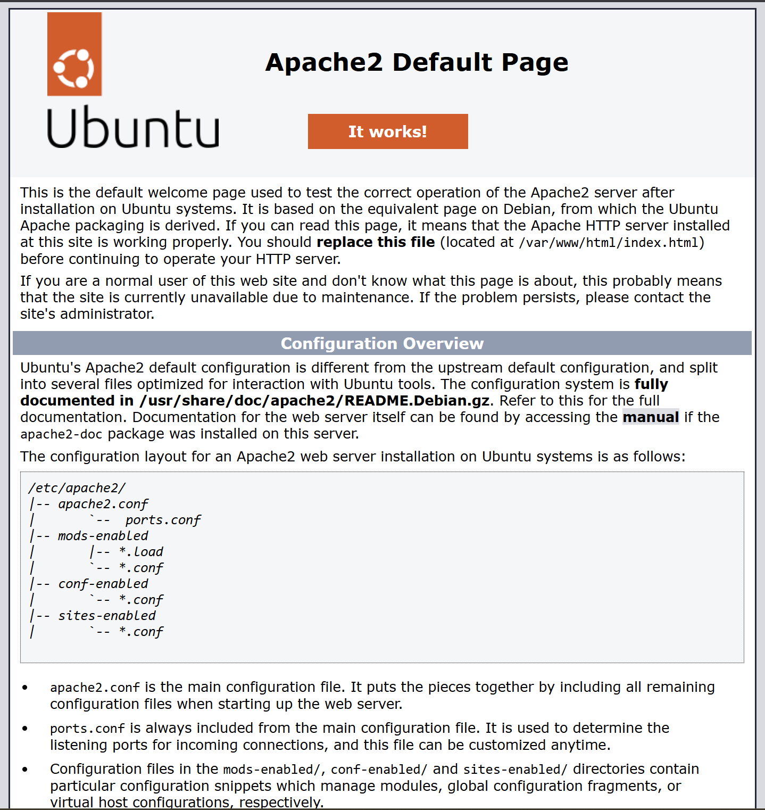
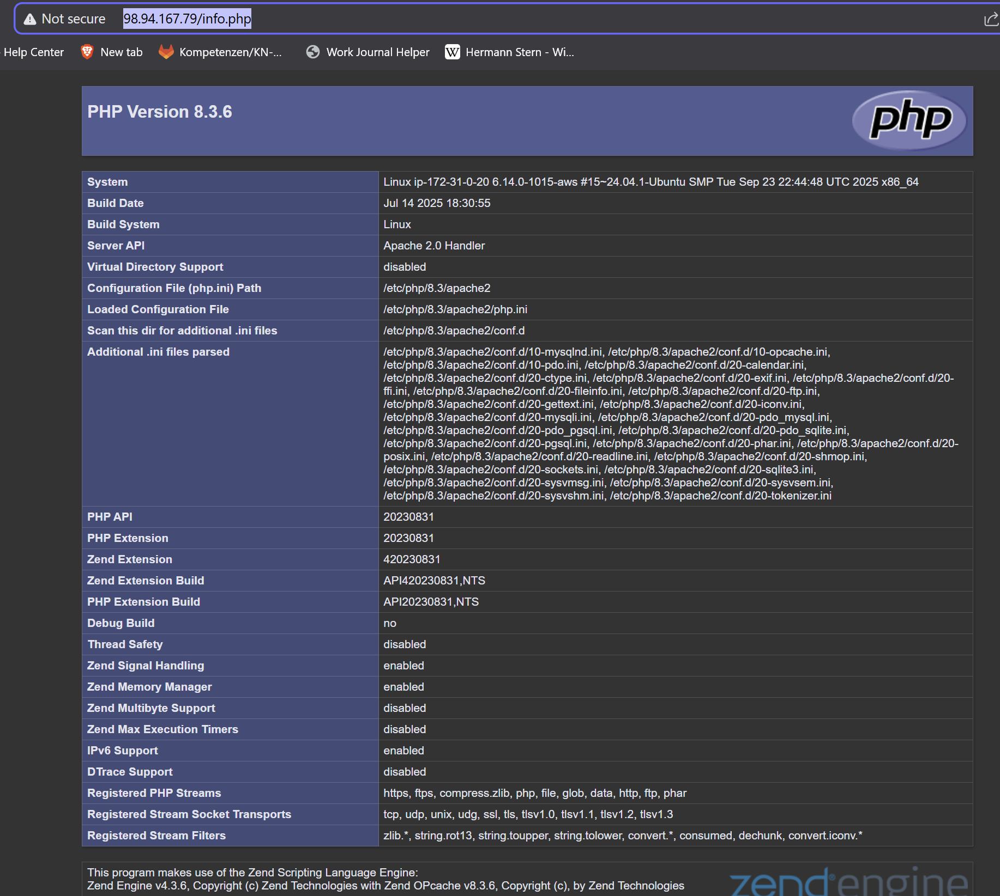
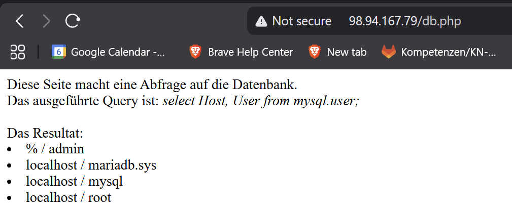

# KN05: Netzwerk / Sicherheit

## A) Grundbegriffe und private IP wählen

### Begriffe

**VPC (Virtual Private Cloud)**
Eine Virtual Private Cloud (VPC) ist ein isoliertes virtuelles Netzwerk in der AWS Cloud, das speziell für ein AWS-Konto reserviert ist. Innerhalb einer VPC hat man die vollständige Kontrolle über die virtuelle Netzwerkumgebung, einschliesslich der Auswahl des IP-Adressbereichs, der Erstellung von Subnetzen sowie der Konfiguration von Routing-Tabellen und Netzwerk-Gateways.

**Subnet**
Ein Subnetz ist ein Bereich von IP-Adressen innerhalb Ihrer VPC. Man unterteilt eine VPC in Subnetze, um Ressourcen (wie EC2-Instanzen) basierend auf Sicherheits- und Betriebsanforderungen zu gruppieren. Ein Subnetz resideiert immer in genau einer Verfügbarkeitszone (Availability Zone).

**Vordefinierte Subnets:**
In einer Standard-AWS-Konfiguration wird normalerweise für jede Verfügbarkeitszone in der Region ein Standard-Subnetz erstellt. (Zum Beispiel 3 Subnetze in einer Region mit 3 Zonen).
*Abdeckung:* Die IP-Ranges der Standard-Subnetze (oft /20) decken zusammen meist nicht den gesamten IP-Range der VPC (oft /16) ab, es bleibt freier Adressraum für benutzerdefinierte Subnetze.

**Öffentliche vs. Private IP vs. Statische IP**

*   **Private IP:** Eine IP-Adresse, die nicht im Internet routingfähig ist. Sie wird für die interne Kommunikation innerhalb der VPC verwendet (z.B. Webserver spricht mit Datenbankserver). Instanzen behalten ihre private IP auch nach einem Neustart.
*   **Öffentliche IP (Public IP):** Eine IP-Adresse, die vom Internet aus erreichbar ist. Sie ist notwendig, damit ein Webserver von aussen aufgerufen werden kann. Bei Standard-EC2-Instanzen kann sich diese Adresse ändern, wenn die Instanz gestoppt und wieder gestartet wird.
*   **Statische IP (Elastic IP):** Eine feste (statische) öffentliche IPv4-Adresse, die einem AWS-Konto zugeordnet ist. Man kann sie einer Instanz zuweisen. Sie bleibt bestehen, auch wenn die Instanz gestoppt und neu gestartet wird, was für Server wichtig ist, die unter einer konstanten Adresse erreichbar sein müssen (z.B. DNS-Einträge).

### Subnetze und IPs

**Definierte Private IPs:**

*   **Datenbank-Server (DB):** `172.31.0.10`
*   **Webserver (Wen):** `172.31.0.20`

## B) Objekte und Instanzen erstellen

### Sicherheitsgruppen

Zwei Sicherheitsgruppen
1.  **SG-Webserver**: Erlaubt SSH (22) und HTTP (80) von überall.
2.  **SG-DB**: Erlaubt MySQL (3306) nur vom internen Webserver.

**Inbound Rules - Webserver:**

**Inbound Rules - DB:**

### Öffentliche, statische IP

Eine Elastic IP wurde erstellt und dem Webserver zugewiesen

### Instanzen erstellen

Die beiden Instanzen (Webserver und DB) wurden im Subnetz **Sub-KN05** erstellt, mit privaten IPs (`172.31.0.20` und `172.31.0.10`).

**Webserver Details (Subnetz & IP):**

**Datenbank Details (Subnetz & IP):**

### Funktionstest

Die Webseite ist über die öffentliche IP erreichbar und kann auf die Datenbank zugreifen.

**Apache Default Page:**

**PHP Info:**

**DB Connection Test:**

