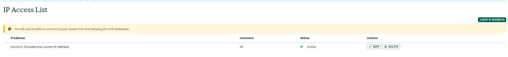
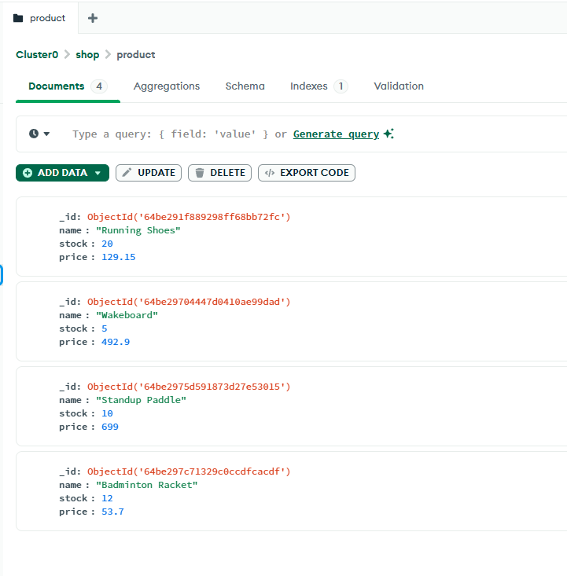
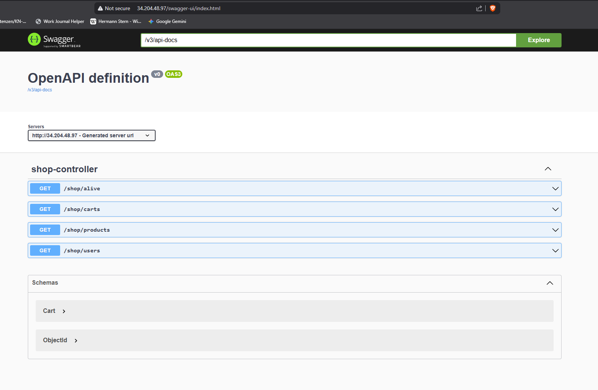
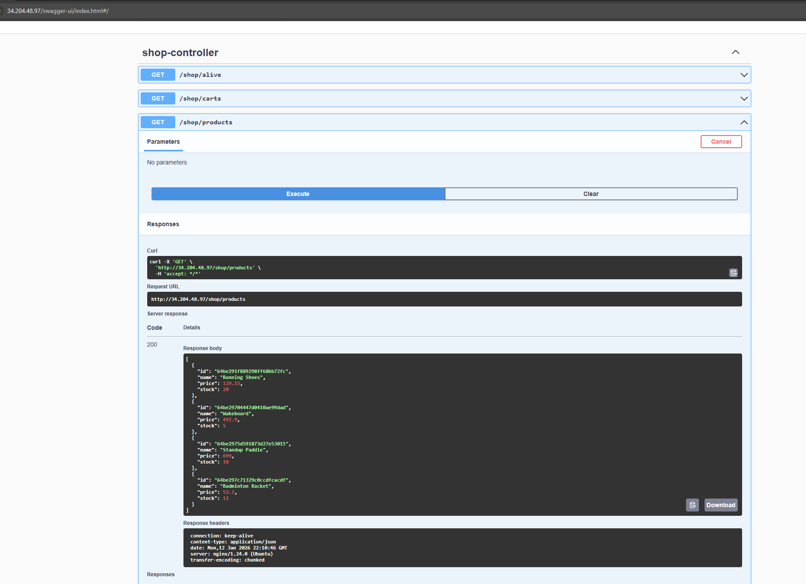
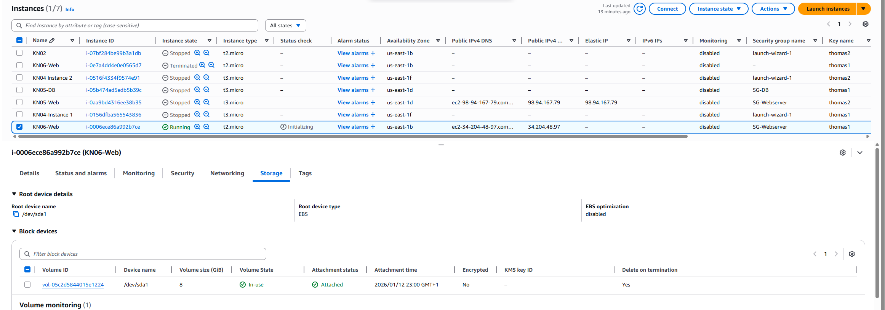
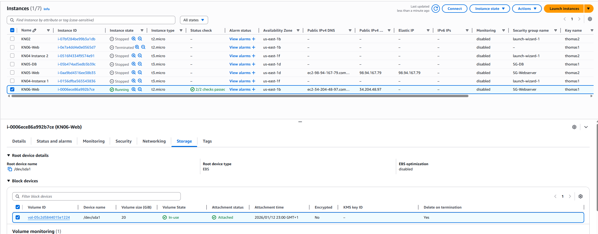
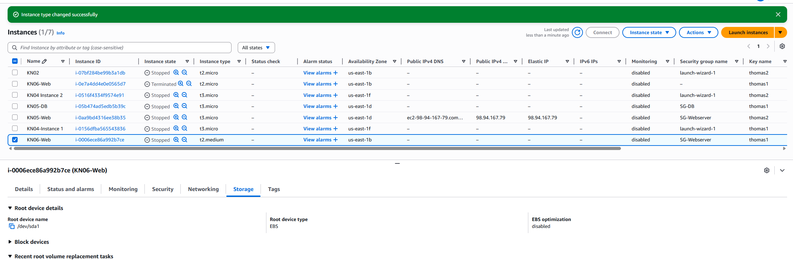
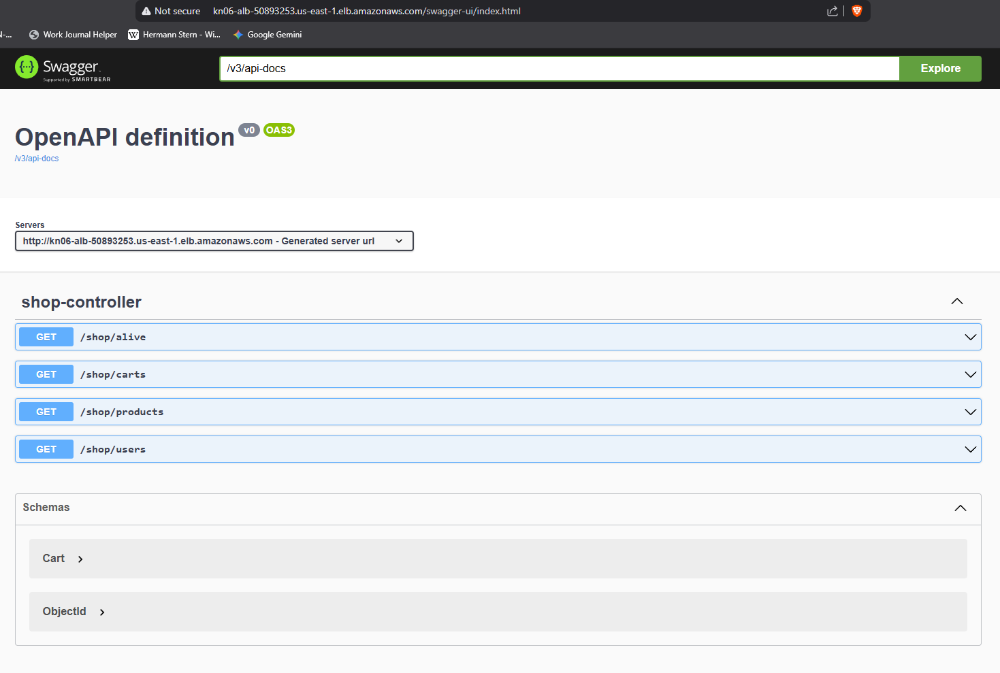

# KN06: Skalierung - Thomas Stern

## Übersicht

In dieser Kompetenznachweis habe ich eine Java Web API mit MongoDB Atlas (SaaS) in Betrieb genommen und verschiedene Skalierungsmethoden (vertikal, horizontal, Auto Scaling) implementiert.

**Setup:**
- **App**: Java Shop Demo (Swagger UI)
- **Datenbank**: MongoDB Atlas (SaaS)
- **Web Server**: Nginx als Reverse Proxy
- **Cloud Provider**: AWS (EC2, ALB, Auto Scaling)

---

## A) Installation App (50%)

### MongoDB Atlas Einrichtung

Die Datenbank wird über MongoDB Atlas als **SaaS-Lösung** gehostet:

- **Cluster URL**: `cluster0.clwmgli.mongodb.net`
- **Username**: `Thomas`
- **Password**: `Thomas-Password`

**Screenshots:**


*Network Access Konfiguration - Erlaubt Zugriff von allen IPs (0.0.0.0/0) für Development*


*MongoDB Collections mit Shop-Daten (Products, Users, Carts)*

---

### Web Server Installation

**Deployment Details:**
- **Instance IP**: `34.204.48.97`
- **Access URL**: http://34.204.48.97/swagger-ui.html
- **Interne App Port**: 5001
- **Öffentlicher Port**: 80 (via Nginx Reverse Proxy)

**Screenshots:**


*Swagger UI mit allen verfügbaren Endpoints*


*Erfolgreicher Aufruf des Products Endpoints mit HTTP 200 und Produktdaten aus MongoDB*

---

### Was ist ein Reverse Proxy?

Ein **Reverse Proxy** ist ein Server, der zwischen dem Client (Browser) und dem eigentlichen Backend-Server steht und eingehende Anfragen weiterleitet.

In unserem Setup:
- **Nginx** empfängt HTTP-Anfragen auf **Port 80** (Standard)
- Leitet diese intern an die **Java-Applikation auf Port 5001** weiter
- Der Benutzer muss nur `http://IP/swagger-ui.html` aufrufen, ohne den Port 5001 zu kennen

**Vorteile:**
- Vereinfachte URL (kein Port erforderlich)
- SSL/TLS-Terminierung möglich
- Load Balancing und Caching
- Versteckt interne Netzwerkstruktur

---

### Cloud-Init Sicherheitsprobleme

Folgende Teile im Cloud-Init machen in einer **produktiven Umgebung KEINEN Sinn**:

1. **Hardcoded Credentials**: 
   - MongoDB Username/Password sind direkt im Cloud-Init sichtbar
   - **Lösung**: AWS Secrets Manager oder Parameter Store verwenden

2. **SSH Public Key hardcoded**:
   - SSH-Key sollte über AWS Key Pairs verwaltet werden
   - **Risiko**: Jeder mit Zugriff auf das Cloud-Init kann sich anmelden

3. **Öffentliches Git Repository**:
   - `git clone` von öffentlichem GitLab-Repo ist unsicher
   - **Lösung**: Private Repository mit Authentication

4. **Keine SSL/TLS Verschlüsselung**:
   - App läuft nur über HTTP (Port 80), nicht HTTPS
   - **Lösung**: SSL-Zertifikat einrichten (Let's Encrypt)

5. **`disable_root: false`**:
   - Root-Login ist aktiviert
   - **Sicherheitsrisiko**: Root sollte deaktiviert sein

6. **Fehlende Firewall-Regeln**:
   - Keine zusätzlichen iptables-Regeln im Script
   - **Lösung**: Principle of Least Privilege über Security Groups

---

## B) Vertikale Skalierung (10%)

### 1. Disk-Skalierung: 8 GB → 20 GB

**Schritte:**
1. AWS Console → EC2 → Volumes
2. Volume auswählen → Actions → Modify Volume
3. Size von 8 auf 20 GB ändern
4. Änderung bestätigen
5. Im Betriebssystem die Partition erweitern:
   ```bash
   sudo growpart /dev/xvda 1
   sudo resize2fs /dev/xvda1
   ```

**Geht dies im laufenden Betrieb?**

✅ **JA!** Die Disk kann im laufenden Betrieb vergrößert werden:
- Die Volume-Größe kann ohne Downtime geändert werden
- Die Partition und das Dateisystem können ebenfalls online erweitert werden
- Keine Unterbrechung des Services

**Screenshots:**


*Vorher: 8 GiB Root-Volume*


*Nachher: 20 GiB Root-Volume*

---

### 2. Instance Type Skalierung: t2.micro → t2.medium

**Schritte:**
1. Instance **stoppen** (Stop Instance)
2. Warten bis Status "Stopped"
3. Actions → Instance Settings → Change Instance Type
4. `t2.medium` auswählen (2 vCPUs, 4 GB RAM)
5. Apply → Instance wieder starten

**Ressourcen Vergleich:**
- **t2.micro**: 1 vCPU, 1 GB RAM
- **t2.medium**: 2 vCPU, 4 GB RAM

**Geht dies im laufenden Betrieb?**

❌ **NEIN!** Der Instance Type kann **NICHT** im laufenden Betrieb geändert werden:
- Die Instance muss zuerst gestoppt werden
- **Downtime**: Ca. 2-3 Minuten (Stop + Change + Start)
- **Produktive Umgebung**: Man würde stattdessen:
  - Eine neue Instance mit t2.medium erstellen
  - Diese in den Load Balancer einfügen
  - Alte Instance aus Load Balancer entfernen
  - Zero-Downtime Deployment

**Screenshot:**


*Nachher: t2.medium mit 2 vCPUs und 4 GiB RAM*

---

## C) Horizontale Skalierung (20%)

### Setup

**Konfiguration:**
- **2 Web Server Instances**:
  - Instance 1: `34.204.48.97`
  - Instance 2: `34.207.147.124`
- **Target Group**: `KN06-TG`
  - Health Check Path: `/swagger-ui.html`
  - Healthy Threshold: 2
  - Unhealthy Threshold: 2
- **Application Load Balancer**: `KN06-ALB`
  - DNS: `KN06-ALB-50893253.us-east-1.elb.amazonaws.com`
  - Listener: HTTP:80
  - Scheme: Internet-facing

**Screenshot:**


*Swagger UI über Load Balancer URL - DNS sichtbar in Adresszeile*

---

### DNS Konfiguration für app.tbz-m346.ch

**Aufgabe**: Die Applikation soll unter `app.tbz-m346.ch` erreichbar sein.

**Lösung:**

Einen **CNAME Record** im DNS erstellen:

```
Type:  CNAME
Name:  app.tbz-m346.ch
Value: KN06-ALB-50893253.us-east-1.elb.amazonaws.com
TTL:   300
```

**Erklärung:**
- CNAME (Canonical Name) ist ein DNS-Record-Typ, der einen Domain-Namen auf einen anderen Domain-Namen zeigt
- Alle Anfragen an `app.tbz-m346.ch` werden automatisch an die Load Balancer DNS weitergeleitet
- Der Load Balancer verteilt dann den Traffic auf die verfügbaren Instances

**Alternative (bei AWS Route 53):**
- **ALIAS Record** verwenden (effizienter als CNAME)
- Vorteil: Funktioniert auch auf der Root-Domain
- Keine zusätzlichen DNS-Lookups nötig

---

### Objekterklärungen

**Load Balancer (ALB):**
- Verteilt eingehende HTTP-Anfragen auf mehrere Backend-Instances
- Ermöglicht Hochverfügbarkeit und horizontale Skalierung
- Ersetzt die Notwendigkeit von statischen IPs (nutzt DNS)

**Target Group:**
- Gruppe von EC2-Instances, die vom Load Balancer angesteuert werden
- Definiert Health Checks zur Überwachung der Instance-Gesundheit
- Nur "healthy" Targets erhalten Traffic

**Health Check:**
- Regelmäßige HTTP-Anfragen an `/swagger-ui.html`
- Prüft alle 30 Sekunden, ob die Instance antwortet
- Nach 2 erfolgreichen Checks: "healthy"
- Nach 2 fehlgeschlagenen Checks: "unhealthy" → kein Traffic mehr

**Listener:**
- Wartet auf eingehende Verbindungen (Port 80)
- Definiert Routing-Regeln (forward to target group)

**Security Groups:**
- **Load Balancer SG**: HTTP (80) von überall (0.0.0.0/0)
- **Instance SG**: HTTP (80) nur vom Load Balancer

**Statische IPs:**
- ❌ Machen bei Load Balancer **KEINEN Sinn** mehr
- Load Balancer hat einen DNS-Namen (nicht fixe IP)
- Elastic IPs werden nicht benötigt

---

## D) Auto Scaling (20%)

### Konfiguration

**Launch Template:**
- **Name**: `M346-KN06-Template`
- **AMI**: Custom AMI (M346-KN06-WebServer-Image)
- **Instance Type**: t2.medium
- **Storage**: 20 GB gp3
- **Security Group**: sg-Webserver

**Auto Scaling Group:**
- **Name**: `M346-KN06-ASG`
- **Desired Capacity**: 2 Instances
- **Minimum Capacity**: 2 Instances
- **Maximum Capacity**: 5 Instances
- **Target Group**: KN06-TG (Load Balancer Integration)
- **Health Check**: ELB Health Checks aktiviert
- **Grace Period**: 300 Sekunden

---

### Funktionsweise

1. **Auto Scaling Group** überwacht kontinuierlich die Anzahl und Gesundheit der Instances
2. Wenn eine Instance ausfällt (Health Check failed):
   - ASG erkennt "unhealthy" Status
   - Terminiert die fehlerhafte Instance
   - Startet automatisch eine neue Instance (aus Launch Template)
3. Neue Instance wird automatisch:
   - In die Target Group eingefügt
   - Von Load Balancer überwacht (Health Checks)
   - Bei "healthy" Status: erhält Traffic

---

### Test: Auto-Healing

**Durchgeführter Test:**
1. Eine der Auto-Scaled Instances manuell terminiert
2. Auto Scaling Group erkennt: Actual < Desired (1 < 2)
3. **Automatische Reaktion** innerhalb von 1-2 Minuten:
   - Neue Instance wird gestartet
   - Cloud-Init installiert die App
   - Health Checks werden bestanden
   - Instance erhält Traffic vom Load Balancer

**Ergebnis:** ✅ Auto-Healing funktioniert erfolgreich!

---

### Objekterklärungen

**Launch Template:**
- Blueprint (Vorlage) für neue Instances
- Definiert: AMI, Instance Type, Security Groups, User Data
- Wird von Auto Scaling Group verwendet

**Desired Capacity:**
- Ziel-Anzahl der laufenden Instances (2)
- ASG versucht immer, diese Anzahl aufrechtzuerhalten

**Min/Max Capacity:**
- **Minimum (2)**: ASG startet mindestens 2 Instances
- **Maximum (5)**: ASG startet maximal 5 Instances
- Verhindert unbegrenztes Scaling (Kostengrund)

**Health Checks (ELB):**
- Load Balancer prüft regelmäßig `/swagger-ui.html`
- Meldet Status an Auto Scaling Group
- Unhealthy Instances werden ersetzt

**Grace Period (300s):**
- Zeit, die ASG wartet, bevor Health Checks starten
- Gibt der Applikation Zeit zum Starten (Cloud-Init, Service-Start)
- Verhindert falsch-positive "unhealthy" Meldungen