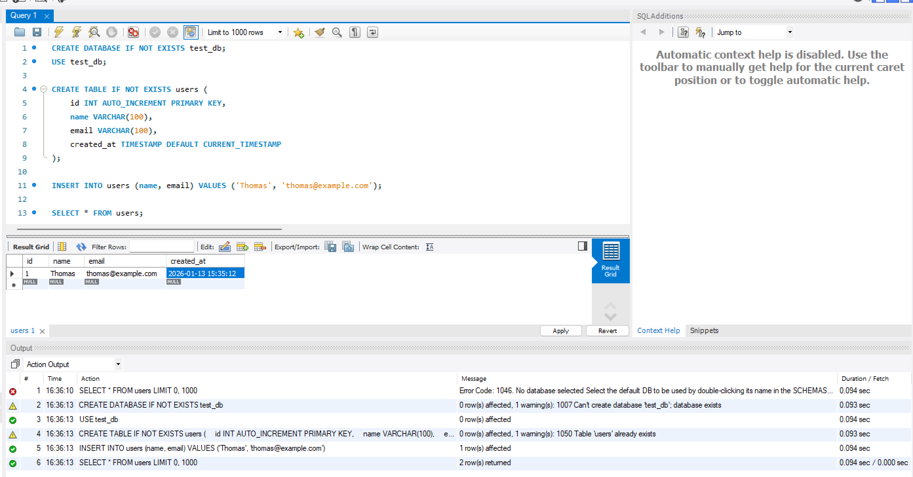
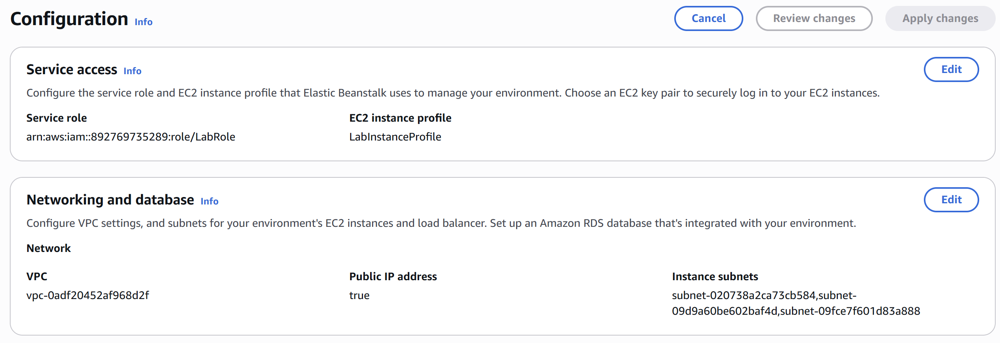
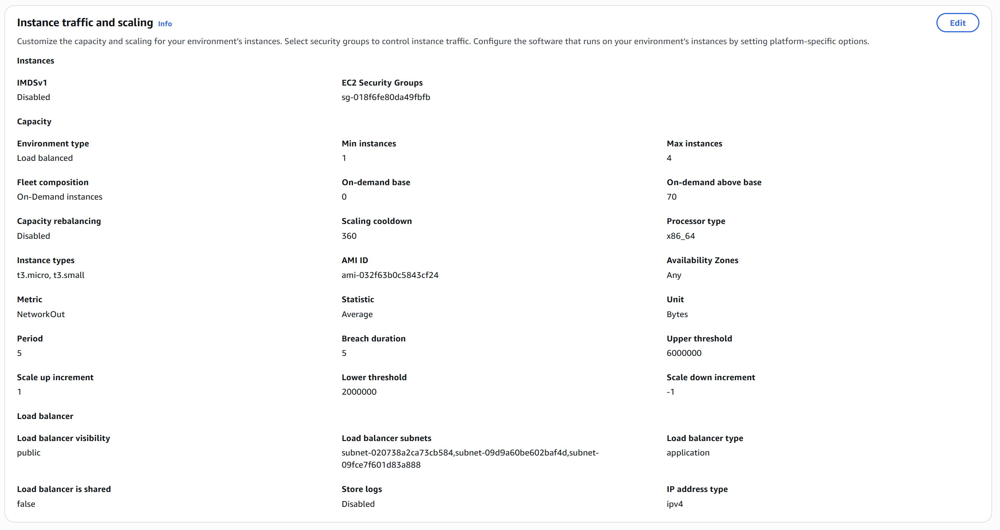
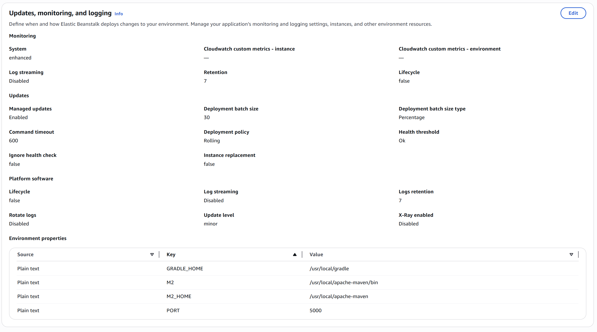
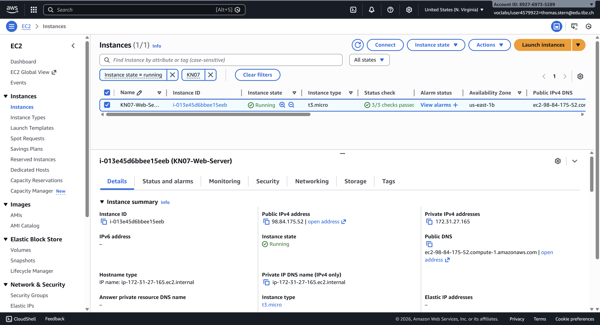
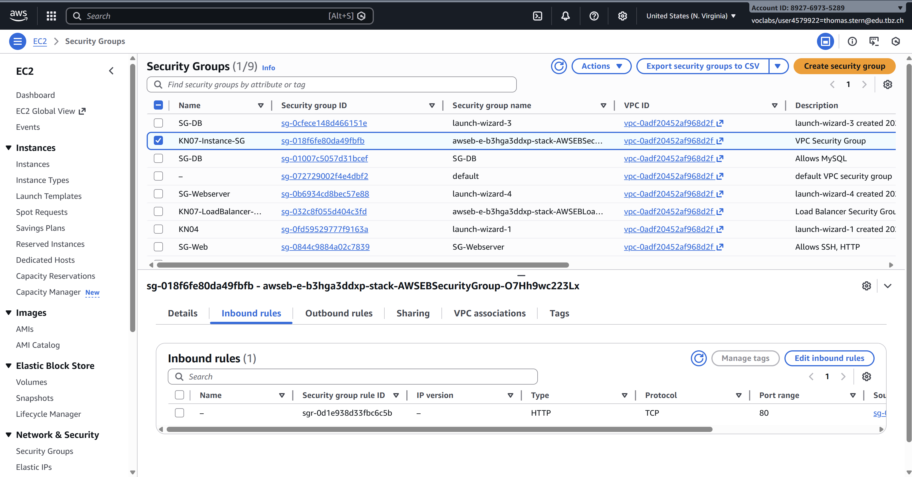
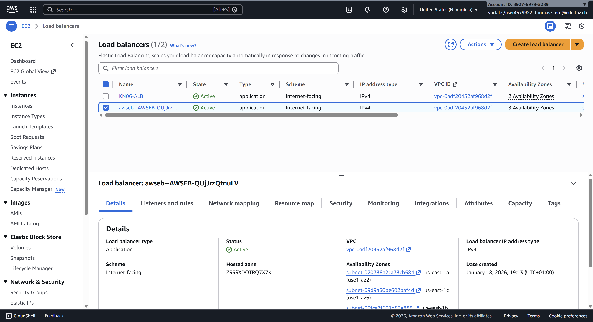
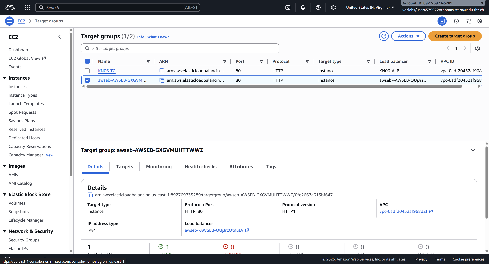
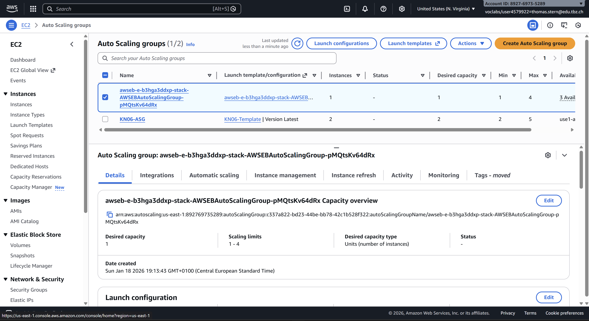
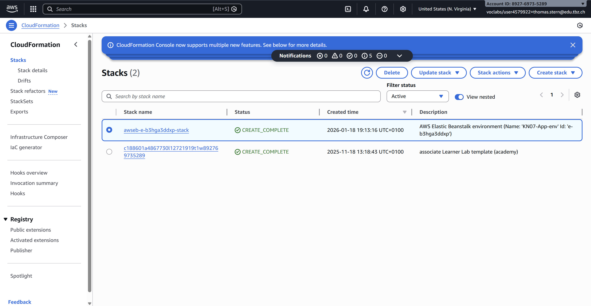

# KN07: PaaS - Thomas Stern

## A) Database in PaaS Model (20%)

### RDS Database Setup

**Connection Test:**

---

### Why PaaS/SaaS Database vs Self-Managed

**PaaS/SaaS Advantages:**
- ✅ Automatic maintenance, patches, and security updates
- ✅ Automated backups with point-in-time recovery
- ✅ High availability with multi-AZ and automatic failover
- ✅ Easy scaling (vertical and horizontal) without downtime
- ✅ Built-in monitoring and performance insights
- ✅ Focus on application development instead of infrastructure

**Self-Managed Disadvantages:**
- ❌ Manual updates, backups, and scaling
- ❌ Higher operational overhead and costs
- ❌ Requires specialized database expertise

---

## B) PaaS Application Deployment (60%)

### Elastic Beanstalk Application

**Application Details:**
- **Application Name**: KN07-App
- **Environment Name**: KN07-App-env
- **Platform**: Java (Amazon Corretto 17)
- **Sample Application**: AWS Corretto Sample Application

---

**1. Service Access & Networking:**

- **Service Role**: Allows Elastic Beanstalk to manage AWS resources
- **VPC**: Default VPC (in production, use custom VPC)
- **Public IP**: Enabled for internet access
- **Subnets**: Multi-AZ deployment (3 availability zones) for high availability

---

**2. Instance Traffic and Scaling:**

- **Load Balancer**: Application Load Balancer (distributes traffic, health checks, zero-downtime deployments)
- **Instance Type**: t3.micro (cost-effective for testing)
- **Auto Scaling**: Min 1, Max 4 instances based on network metrics

---

**3. Monitoring & Logging:**

- **CloudWatch**: Basic monitoring (5-min intervals) and log streaming
- **Enhanced Health Reporting**: Detailed environment health status
- **Managed Updates**: Weekly maintenance window

---

**4. Running Application:**

✅ Application successfully deployed and accessible.

---

## C) Auto-Created Resources and CloudFormation (20%)

### AWS Resources Created Automatically

**1. EC2 Instances:**

- **Instance Type**: t3.micro
- **Status**: Running

---

**2. Security Groups:**

- **Instance Security Group**: Protects EC2 instances, allows HTTP only from Load Balancer
- **Load Balancer Security Group**: Protects Load Balancer, allows HTTP from anywhere
- **Security Best Practice**: Instances not directly exposed to internet

---

**3. Application Load Balancer:**

- **Type**: Application Load Balancer
- **Status**: Active
- **Scheme**: Internet-facing
- **Availability Zones**: 3 (us-east-1a, us-east-1b, us-east-1c)

---

**4. Target Groups:**

- **Target Type**: Instance
- **Protocol**: HTTP (Port 80)
- **Registered Targets**: 1 healthy instance

---

**5. Auto Scaling Group:**

- **Desired Capacity**: 1 instance
- **Min**: 1, **Max**: 4
- **Instance Type**: t3.micro
- **Scaling Policies**:
  - Scale Up: NetworkOut > 6,000,000 bytes for 300 seconds
  - Scale Down: NetworkOut < 2,000,000 bytes for 300 seconds

---

**6. CloudFormation Stack:**

- **Status**: CREATE_COMPLETE
- **Total Resources Created**: 14
- Includes: Auto Scaling Group, Security Groups, Load Balancer, Target Groups, CloudWatch Alarms, IAM roles

---

### CloudFormation vs Cloud-Init

| Aspect | CloudFormation | Cloud-Init |
|--------|---------------|------------|
| **What** | Infrastructure as Code (IaC) | Instance initialization tool |
| **Scope** | AWS Infrastructure | OS Configuration |
| **Level** | Infrastructure Layer | Operating System Layer |
| **Purpose** | Create/manage AWS resources | Configure instances at boot |
| **Format** | JSON/YAML templates | YAML or shell scripts |
| **Execution** | AWS API calls | Runs inside the instance |
| **When** | Provisions infrastructure | After instance starts |
| **Idempotency** | Yes (manages state) | Partial (depends on script) |
| **Rollback** | Automatic | Manual |
| **Examples** | Create VPC, EC2, RDS, Load Balancers | Install Nginx, create users, configure apps |
| **Use Cases** | Multi-tier environments, replicable infra | Software setup, system configuration |

**Summary:**
- **CloudFormation** = "What AWS resources do I need?" (Infrastructure)
- **Cloud-Init** = "How do I configure those resources?" (Software)

**In Elastic Beanstalk:**
1. CloudFormation creates infrastructure (EC2, Load Balancer, Auto Scaling, etc.)
2. Cloud-Init configures instances with the application

---
