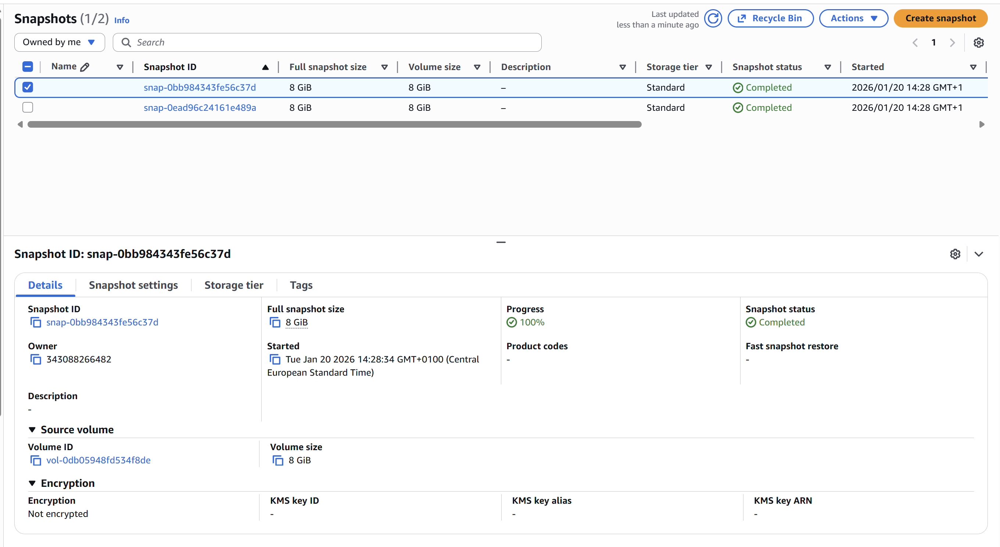
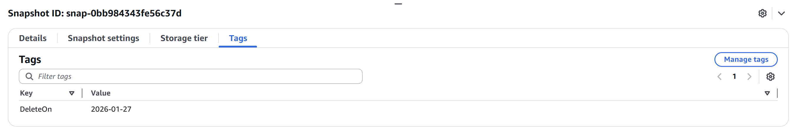
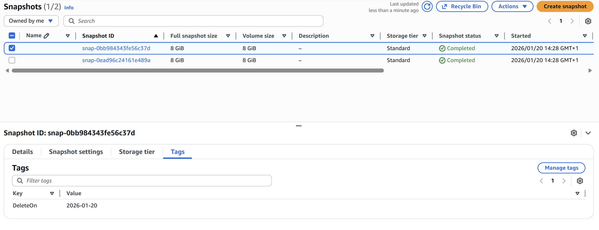
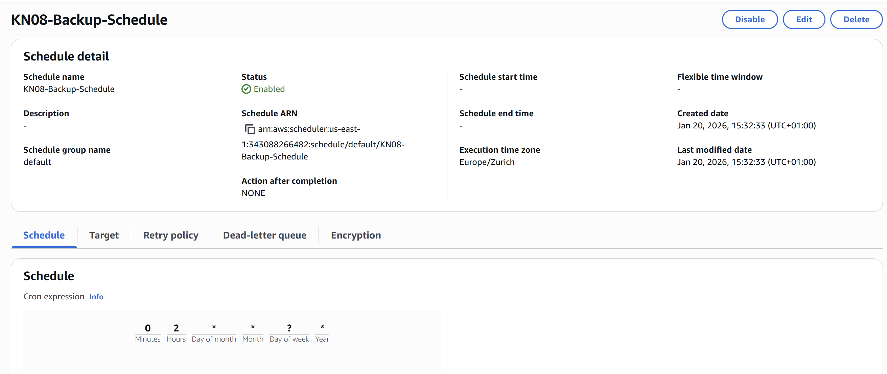

# KN08: FaaS und Backup - Thomas Stern

## A) Backup-Skript (70%)

### Skripte
- [`lambda_backup.py`](lambda_backup.py) - Erstellt Snapshots von EC2-Instanzen mit Tag `Backup=true`
- [`lambda_cleanup.py`](lambda_cleanup.py) - Löscht Snapshots basierend auf `DeleteOn` Tag

### Abgabe

**Screenshot der Instanzen mit dem korrekten Tag:**

---

**Screenshot der Liste der erstellten Snapshots:**

---

**Screenshot der Tags eines der erstellten Snapshots:**

---

**Screenshot der Liste nachdem Cleanup ausgeführt wurde:**

---

## B) CRON-Job (30%)

**EventBridge Schedule für automatisierte Ausführung:**

Die Backup Lambda-Funktion wird täglich automatisch um 2:00 Uhr UTC ausgeführt.

---
