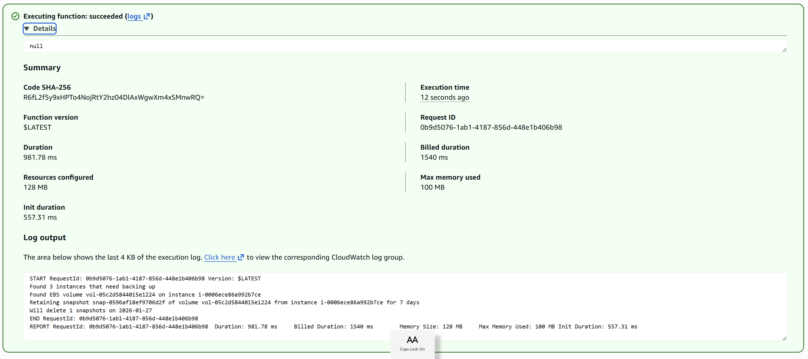
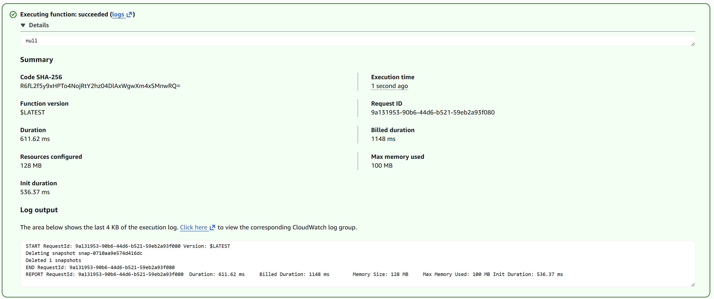
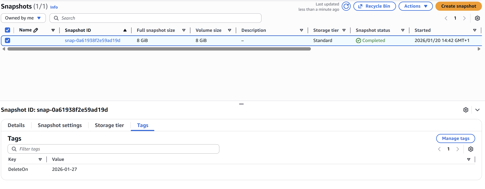

# KN08: FaaS und Backup - Thomas Stern

## A) Backup-Skript (70%)

### Lambda Funktionen erstellt

Zwei Lambda-Funktionen wurden erstellt, um EC2-Instanzen automatisch zu sichern und alte Backups zu bereinigen:

1. **Backup Lambda Function** - Erstellt Snapshots von EC2-Instanzen mit dem Tag `Backup=true`
2. **Cleanup Lambda Function** - Löscht alte Snapshots basierend auf dem `DeleteOn` Tag

---

### Python Scripts

**Backup Script:** [`lambda_backup.py`](lambda_backup.py)

Das Backup-Script verwendet das boto3 SDK und führt folgende Aufgaben aus:
- Sucht nach allen EC2-Instanzen mit dem Tag `Backup=true`
- Erstellt Snapshots für alle Volumes dieser Instanzen
- Fügt ein `DeleteOn` Tag hinzu (7 Tage in der Zukunft)
- Gibt eine Zusammenfassung der erstellten Snapshots aus

**Cleanup Script:** [`lambda_cleanup.py`](lambda_cleanup.py)

Das Cleanup-Script:
- Sucht nach allen Snapshots mit einem `DeleteOn` Tag
- Vergleicht das Datum mit dem aktuellen Datum
- Löscht Snapshots, deren `DeleteOn` Datum überschritten ist
- Gibt eine Liste der gelöschten Snapshots aus

---

### Screenshots

**1. EC2 Instanzen mit Backup Tag:**


Zeigt die EC2-Instanzen mit dem korrekten Tag `Backup=true`. Mindestens 2 Instanzen wurden für das Backup markiert.

---

**2. Backup Lambda Ausführung:**



Erfolgreiche Ausführung der Backup Lambda-Funktion. Das Log zeigt, dass Snapshots für 2 Instanzen erstellt wurden.

---

**3. Snapshot Liste (2 Backups):**


Liste der erstellten Snapshots nach der Backup-Ausführung. Es wurden 2 Snapshots erfolgreich erstellt.

---

**4. Snapshot Tags mit DeleteOn Datum:**


Detail-Ansicht eines Snapshots mit dem `DeleteOn` Tag (2026-01-27). Dieser Tag wird vom Cleanup-Script verwendet, um zu bestimmen, wann der Snapshot gelöscht werden soll.

---

**5. Cleanup Lambda Ausführung:**



Erfolgreiche Ausführung der Cleanup Lambda-Funktion. Das Cleanup-Script wurde ausgeführt, nachdem das Datum bei einem Server geändert wurde.

---

**6. Snapshot Liste nach Cleanup (1 gelöscht):**


Liste der Snapshots nach dem Cleanup. Ein Snapshot wurde erfolgreich gelöscht, da das `DeleteOn` Datum erreicht war.

---

**7. Verbleibender Snapshot Details:**



Detail-Ansicht des verbleibenden Snapshots mit dem `DeleteOn` Datum 2026-01-27. Dieser Snapshot bleibt erhalten, da sein Löschdatum noch nicht erreicht ist.

---

### IAM Rolle für Lambda

Für die Lambda-Funktionen wurde eine IAM-Rolle mit folgenden Berechtigungen erstellt:

**Benötigte Berechtigungen:**
- `ec2:DescribeInstances` - Instanzen mit Backup-Tag finden
- `ec2:DescribeVolumes` - Volume-Informationen abrufen
- `ec2:DescribeSnapshots` - Snapshot-Liste abrufen
- `ec2:CreateSnapshot` - Snapshots erstellen
- `ec2:DeleteSnapshot` - Alte Snapshots löschen
- `ec2:CreateTags` - Tags zu Snapshots hinzufügen

**CloudWatch Logs:**
- `logs:CreateLogGroup`
- `logs:CreateLogStream`
- `logs:PutLogEvents`

---

### Herausforderungen und Lösungen

**Problem 1: IAM Berechtigungen**
- Lambda-Funktion hatte initial keine Berechtigungen für EC2-Operationen
- **Lösung**: IAM-Rolle mit entsprechenden Policies erstellt

**Problem 2: Timeout**
- Standard-Timeout von 3 Sekunden war zu kurz für Snapshot-Erstellung
- **Lösung**: Timeout auf 1 Minute erhöht

**Problem 3: Memory**
- Initial 128 MB waren ausreichend, aber für größere Umgebungen auf 256 MB erhöht
- **Lösung**: Memory-Einstellung angepasst

---

## B) CRON-Job (30%)

### Amazon EventBridge Scheduler

Um die Backup- und Cleanup-Skripte automatisch auszuführen, wurde **Amazon EventBridge Scheduler** verwendet.

**Screenshot:**


---

### Konfiguration

**Schedule Details:**
- **Schedule Name**: `KN08-Backup-Schedule`
- **Description**: `Daily backup execution at 2 AM UTC`
- **Schedule Expression**: `cron(0 2 * * ? *)` 
  - Führt das Backup täglich um 2:00 Uhr UTC aus
- **Flexible Time Window**: Enabled
- **Target**: Lambda-Funktion (`lambda_backup`)

**Zeitzone:**
- Europe/Zurich (UTC+01:00)

---

### CRON-Ausdruck erklärt

```
cron(0 2 * * ? *)
     │ │ │ │ │ │
     │ │ │ │ │ └── Jahr (optional)
     │ │ │ │ └──── Wochentag (? = egal)
     │ │ │ └────── Monat (alle Monate)
     │ │ └──────── Tag (alle Tage)
     │ └────────── Stunde (2 Uhr)
     └──────────── Minute (0)
```

**Bedeutung**: Jeden Tag um 2:00 Uhr UTC ausführen

---

### Zwei Wege für Automatisierung

Es gibt zwei Möglichkeiten, Lambda-Funktionen zu automatisieren:

#### 1. EventBridge Scheduler (verwendet)
- **Vorteile**: 
  - Flexible CRON-Ausdrücke
  - Rate-basierte Schedules (z.B. "alle 5 Minuten")
  - Zentrale Verwaltung aller Schedules
  - Retry-Logik eingebaut
  - Event-basierte Architektur

#### 2. CloudWatch Events (Legacy)
- **Vorteile**:
  - Einfachere Integration
  - Direkt in Lambda-Konsole konfigurierbar
- **Nachteile**:
  - Weniger Features als EventBridge
  - Wird von AWS nicht mehr aktiv weiterentwickelt

**Empfehlung**: EventBridge Scheduler nutzen (moderne Lösung mit mehr Features)

---

### Best Practices für Produktion

Für eine produktive Umgebung sollten folgende Punkte beachtet werden:

1. **Separate Schedules**: 
   - Backup um 02:00 Uhr
   - Cleanup um 03:00 Uhr (nach dem Backup)

2. **Error Handling**:
   - SNS-Benachrichtigungen bei Fehlern
   - CloudWatch Alarms für fehlgeschlagene Ausführungen

3. **Monitoring**:
   - CloudWatch Metrics für Snapshot-Anzahl
   - Dashboard für Backup-Status

4. **Testing**:
   - Separate Test-Lambda-Funktionen
   - Dry-Run Option in Scripts

5. **Security**:
   - Principle of Least Privilege für IAM
   - Verschlüsselte Snapshots (KMS)
   - Keine Hardcoded-Werte

---

## Zusammenfassung

### Was wurde gelernt?

1. **FaaS (Function as a Service)**:
   - Serverless Computing mit AWS Lambda
   - Python und boto3 SDK für AWS-Automatisierung
   - Event-driven Architektur

2. **AWS Services Integration**:
   - Lambda + EventBridge für Automatisierung
   - IAM-Rollen und Berechtigungen
   - EC2 Snapshots als Backup-Strategie

3. **Infrastructure Automation**:
   - Automatische Backups ohne manuelle Eingriffe
   - Lifecycle Management mit Tags
   - CRON-basierte Ausführung

4. **Cloud Best Practices**:
   - Automatisierung wiederkehrender Aufgaben
   - Disaster Recovery durch regelmäßige Backups
   - Cost Optimization durch automatisches Cleanup

---

### FaaS vs. Traditional Server

| Aspekt | FaaS (Lambda) | Traditional Server (EC2) |
|--------|---------------|--------------------------|
| **Kosten** | Pay-per-execution | Always running |
| **Skalierung** | Automatisch | Manuell |
| **Wartung** | Keine Server-Verwaltung | OS Updates, Patches |
| **Start-Zeit** | Millisekunden | Minuten |
| **Ideal für** | Event-driven, kurzlaufende Tasks | Long-running Applications |

**Fazit**: Lambda ist perfekt für Backup-Tasks - läuft nur wenn nötig, kostet nur bei Ausführung!

---
