# KN09: Automation - Thomas Stern

## A) Automatisierung mit Command Line Interface (CLI) (30%)

### Task 1: Instanz stoppen und starten

**Befehle:**
```bash
aws ec2 stop-instances --instance-ids i-0123456789abcdef0
aws ec2 start-instances --instance-ids i-0123456789abcdef0
aws ec2 describe-instances --instance-ids i-0123456789abcdef0
```

**Screenshots:**

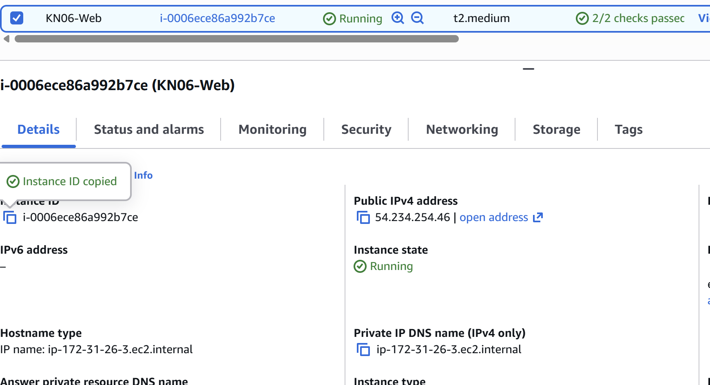


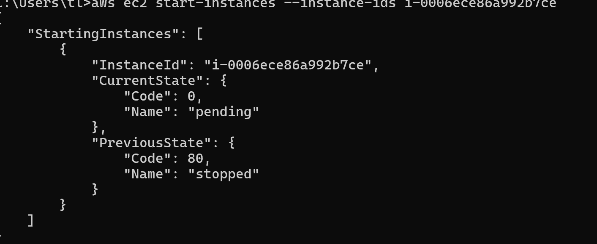


---

### Task 2: Database Server erstellen

**Cloud-Init:** `db-cloud-init.yaml`

**Befehle:**
```bash
# Security Group erstellen (NUR SSH, KEIN Port 3306 wegen AWS Academy!)
aws ec2 create-security-group \
  --group-name db-sg-kn09-cli \
  --description "Security group for KN09 DB server"

aws ec2 authorize-security-group-ingress \
  --group-id sg-xxxxx --protocol tcp --port 22 --cidr 0.0.0.0/0

# Instance erstellen mit Cloud-Init
aws ec2 run-instances \
  --image-id ami-0e86e20dae9224db8 \
  --instance-type t2.micro \
  --key-name thomas1 \
  --security-group-ids sg-xxxxx \
  --user-data file://db-cloud-init.yaml \
  --tag-specifications "ResourceType=instance,Tags=[{Key=Name,Value=DB-Server-KN09-CLI}]"
```

**Detailliertes Script:** `part-a-task2-commands.ps1`

**Screenshots:**

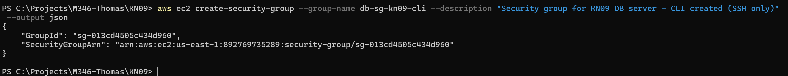

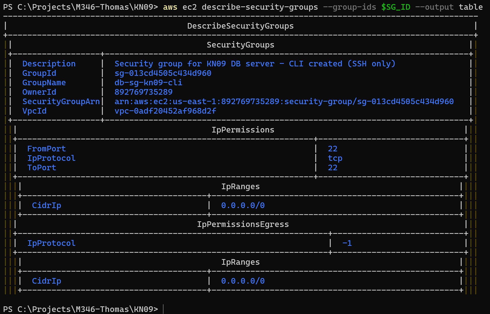

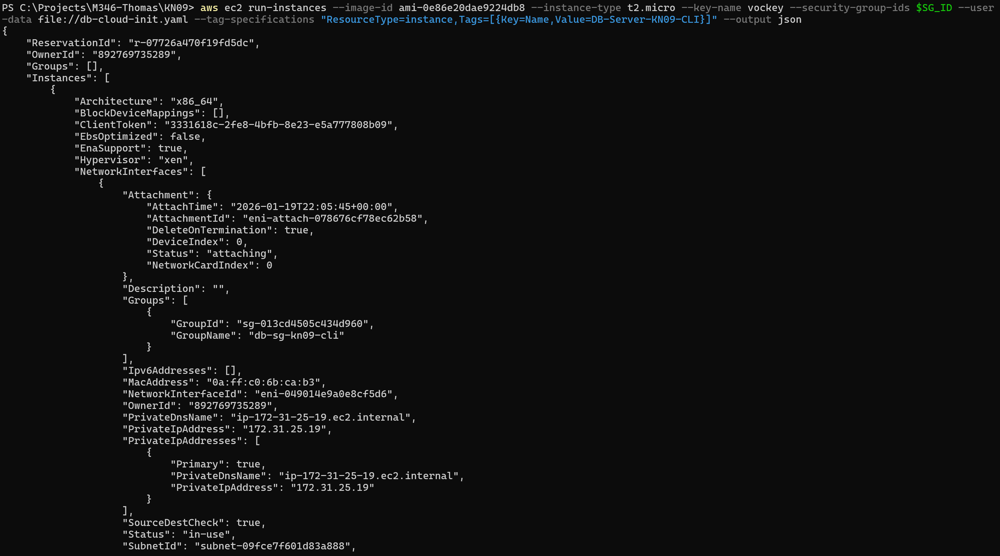


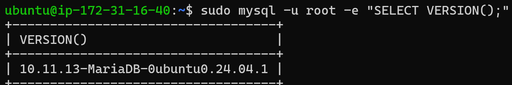

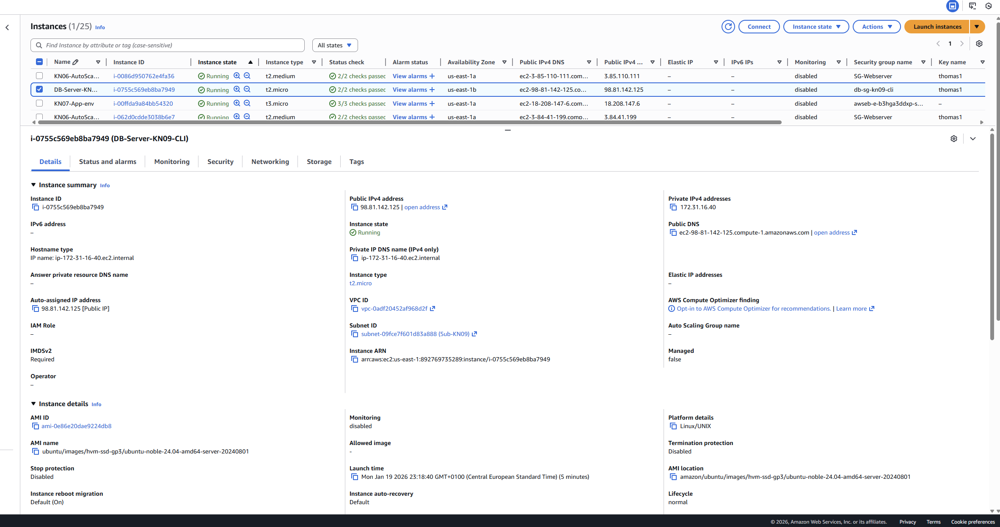

**Hinweis:** Port 3306 wurde **nicht** geöffnet, um AWS Academy Account-Sperrung zu vermeiden. MariaDB-Test erfolgte via SSH.

---

### Task 3: KN05 Nachbildung via CLI

**Vollständige Befehls-Liste:** `kn09-cli-commands.md` (407 Zeilen)

Beispiele:
```bash
# VPC erstellen
aws ec2 create-vpc \
  --cidr-block 10.0.0.0/16 \
  --tag-specifications "ResourceType=vpc,Tags=[{Key=Name,Value=vpc-kn09}]"

# Internet Gateway erstellen
aws ec2 create-internet-gateway \
  --tag-specifications "ResourceType=internet-gateway,Tags=[{Key=Name,Value=igw-kn09}]"

# ... (siehe kn09-cli-commands.md für vollständige Liste)
```

---

### Was ist notwendig für CLI-Automatisierung?

Die Befehle können **nicht** einfach nacheinander ausgeführt werden. Notwendig ist:

#### 1. **Dynamisches ID-Capturing**
Ressourcen-IDs müssen erfasst und in nachfolgenden Befehlen verwendet werden:
```powershell
$VPC_ID = (aws ec2 create-vpc --cidr-block 10.0.0.0/16 --query 'Vpc.VpcId' --output text)
aws ec2 create-subnet --vpc-id $VPC_ID --cidr-block 10.0.1.0/24
```

#### 2. **Error Handling**
Jeder Befehl muss auf Erfolg geprüft werden:
```powershell
if ($LASTEXITCODE -ne 0) {
    Write-Error "Failed!"
    exit 1
}
```

#### 3. **Wait States**
Warten bis Ressourcen verfügbar sind:
```bash
aws ec2 wait instance-running --instance-ids $INSTANCE_ID
```

#### 4. **Idempotenz**
Prüfen ob Ressourcen bereits existieren:
```powershell
$EXISTING = (aws ec2 describe-vpcs --filters "Name=tag:Name,Values=vpc-kn09" ...)
if ($EXISTING -eq "None") { # Erstellen } else { # Verwenden }
```

#### 5. **State Management**
Alle IDs speichern für Cleanup:
```powershell
@{ VpcId=$VPC_ID; SubnetId=$SUBNET_ID } | ConvertTo-Json | Out-File "state.json"
```

#### 6. **Dependency Management**
Reihenfolge beachten: VPC → Subnet → Security Group → Instance

**Fazit:** CLI-Automatisierung ist **komplex** und **fehleranfällig**. Daher gibt es Tools wie Terraform!

---

## B) Terraform (70%)

### Terraform Konfiguration

**Verzeichnis:** `terraform-kn09/`

**Datei:**
- `main.tf` - Vollständige Terraform-Konfiguration mit:
  - **Provider**: AWS (Region: us-east-1) mit Terraform-Version
  - **Variables**: Instance Type, DB Name
  - **Locals**: Cloud-Init Konfiguration für MariaDB Installation
  - **Data Sources**: Default VPC, Latest Ubuntu 22.04 AMI
  - **Security Group**: SSH-Zugriff (Port 22 only)
  - **EC2 Instance**: Database Server mit dynamischer AMI-Suche
  - **Outputs**: Instance ID, Public IP, Security Group ID, Connection Test Command

---

### Terraform Befehle

```bash
terraform init      # Provider herunterladen
terraform fmt       # Code formatieren
terraform validate  # Konfiguration prüfen
terraform plan      # Preview der Änderungen
terraform apply     # Infrastruktur erstellen
terraform output    # Outputs anzeigen
terraform destroy   # Aufräumen
```

---

### Screenshots


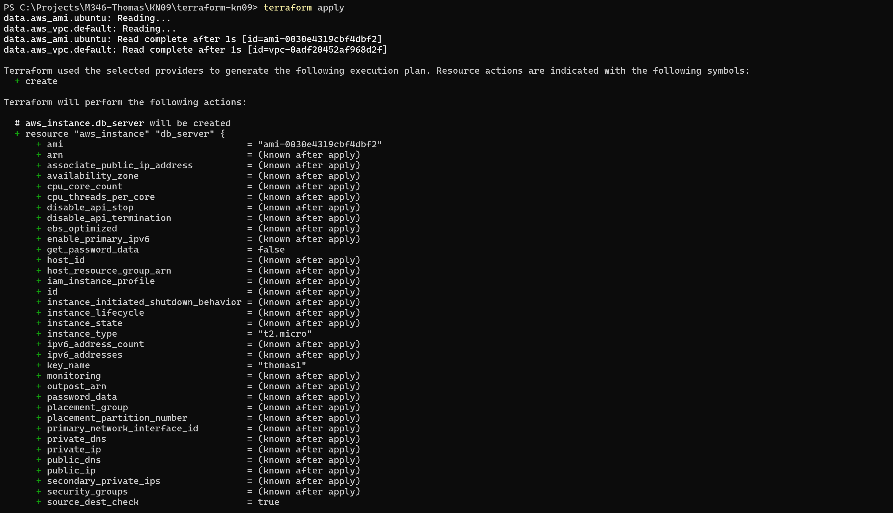

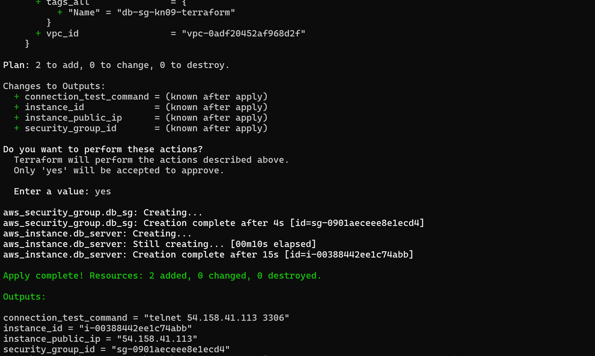

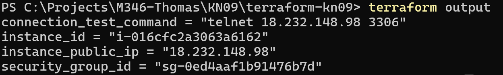

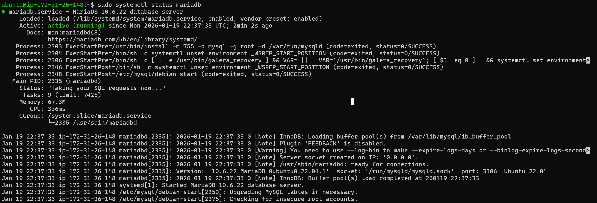

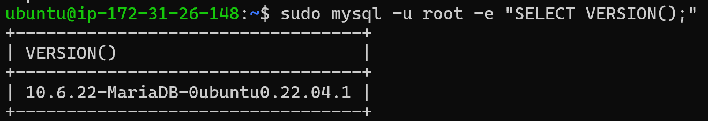

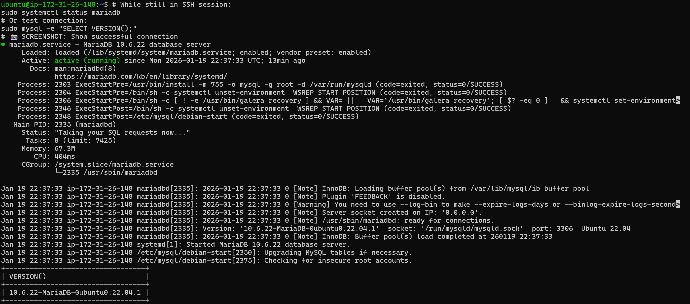

---

### Warum ist Terraform einfacher als CLI?

| Aspekt | CLI | Terraform |
|--------|-----|-----------|
| **ID-Capturing** | Manuell: `$VPC_ID = (aws ec2 create-vpc ...)` | Automatisch: `aws_vpc.main.id` |
| **Reihenfolge** | Manuell festlegen | Automatischer Dependency Graph |
| **State** | Manuell tracken (JSON-Datei) | `terraform.tfstate` automatisch |
| **Idempotenz** | Manuell prüfen ob existiert | Eingebaut - `apply` immer sicher |
| **Preview** | Nicht möglich | `terraform plan` zeigt Änderungen |
| **Fehler** | Manuelles Cleanup | State bleibt aktuell, retry möglich |
| **Cleanup** | Reverse-Reihenfolge manuell | `terraform destroy` - ein Befehl |
| **Syntax** | Imperativ (WIE) | Deklarativ (WAS) |

**Beispiel:**

**CLI (komplex):**
```powershell
$VPC_ID = (aws ec2 create-vpc ... --query 'Vpc.VpcId' --output text)
if ($LASTEXITCODE -ne 0) { exit 1 }
$SG_ID = (aws ec2 create-security-group --vpc-id $VPC_ID --query 'GroupId' ...)
if ($LASTEXITCODE -ne 0) { exit 1 }
aws ec2 authorize-security-group-ingress --group-id $SG_ID ...
aws ec2 run-instances --security-group-ids $SG_ID ...
aws ec2 wait instance-running --instance-ids $INSTANCE_ID
```

**Terraform (einfach):**
```hcl
resource "aws_security_group" "db_sg" {
  vpc_id = data.aws_vpc.default.id
  # ...
}

resource "aws_instance" "db_server" {
  vpc_security_group_ids = [aws_security_group.db_sg.id]
  # ...
}
```

Terraform macht **alles automatisch**: Dependencies, Waits, Error Handling, State Management!

---
