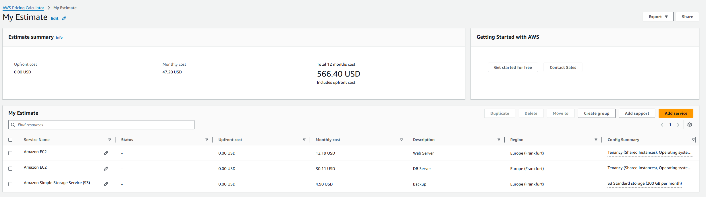
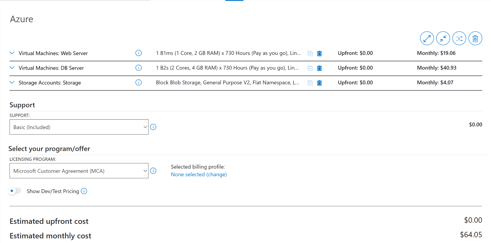
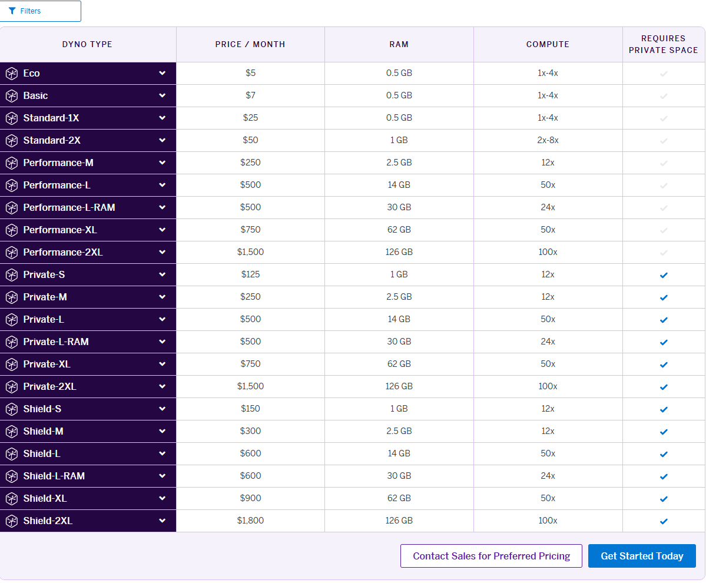
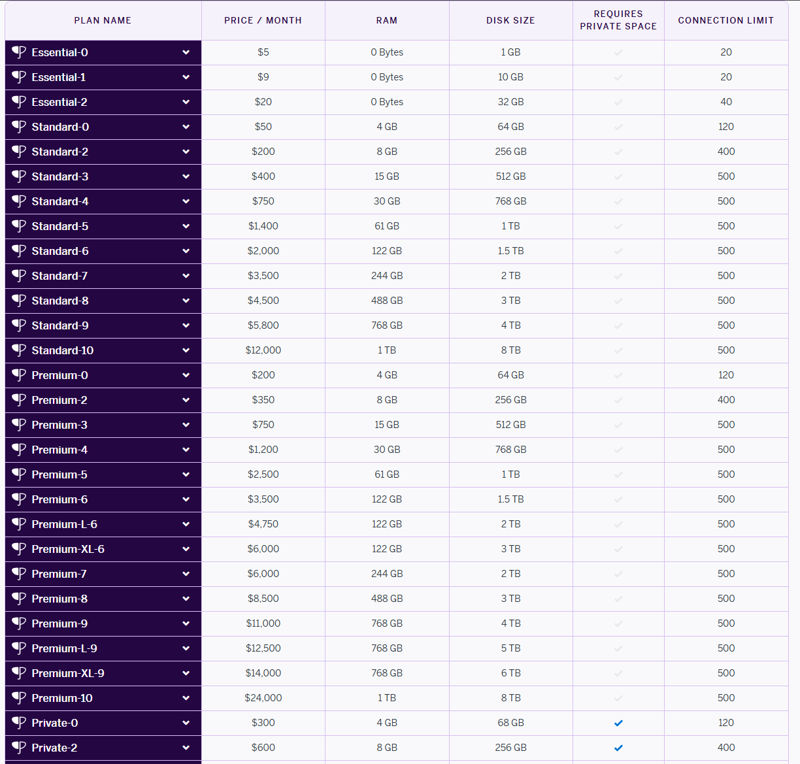
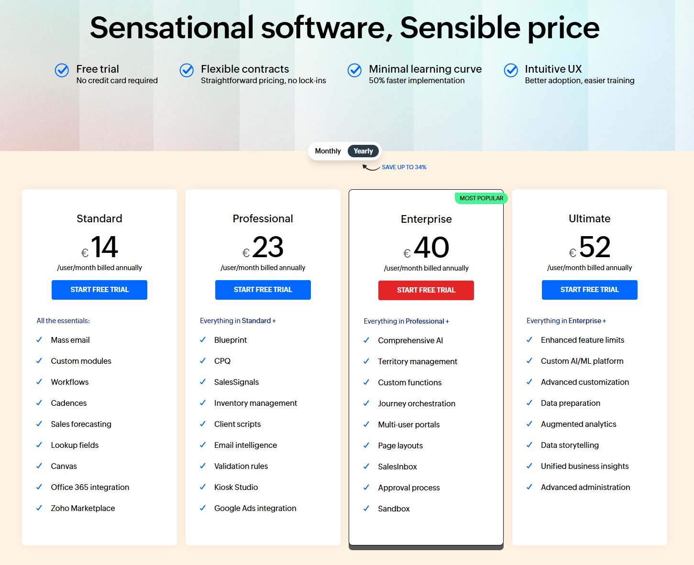

# KN10: Kostenberechnung Cloud Migration

Kostenvergleich für die Migration einer CRM-Software in die Cloud.

## Ausgangslage

**On Premise Infrastruktur:**
- Web Server: 1 Core, 20GB Speicher, 2 GB RAM, Ubuntu
- DB Server: 2 Cores, 100GB Speicher, 4 GB RAM, Ubuntu
- Backup: täglich (7 Tage) + wöchentlich (4 Wochen) + monatlich (3 Monate)
- Benutzer: 30

---

## A) IaaS - Rehosting

### AWS Kostenrechnung

**Gewählte Komponenten:**
- **Web Server:** EC2 t3.small (2 vCPU, 2 GB RAM) + 20 GB EBS gp3
- **DB Server:** EC2 t3.medium (2 vCPU, 4 GB RAM) + 100 GB EBS gp3
- **Backup:** S3 Standard, ca. 200 GB Storage

**Kosten:** ca. **45 USD / Monat**

**Begründung:** Die t3.small Instanz erfüllt die Mindestanforderungen für den Webserver kostengünstig. Für die Datenbank wurde t3.medium gewählt, um die geforderten 4 GB RAM bereitzustellen. S3 Storage bietet eine kosteneffiziente Backup-Lösung.

---

### Azure Kostenrechnung

**Gewählte Komponenten:**
- **Web Server:** VM B1ms (1 vCPU, 2 GB RAM) + Standard SSD 32 GB
- **DB Server:** VM B2s (2 vCPU, 4 GB RAM) + Standard SSD 128 GB
- **Backup:** Blob Storage, ca. 200 GB

**Kosten:** ca. **65 USD / Monat**

**Begründung:** Die B-Serie (Burstable) eignet sich für Workloads, die nicht permanent 100% CPU benötigen - typisch für Webserver. B1ms erfüllt exakt die 2 GB RAM Anforderung, B2s passt perfekt für den DB-Server mit 4 GB RAM.

---

## B) PaaS - Replatforming (Heroku)

### Dyno Pricing

### Postgres Pricing

**Gewählte Komponenten:**
- **Web Dyno:** Standard 2X (1 GB RAM) - 50 USD
- **Postgres:** Standard 2 (256 GB Storage, 8 GB RAM) - 200 USD
  - Backups sind im Preis inklusive

**Kosten:** **250 USD / Monat**

**Begründung:** Standard 2X ist der realistischste Einstiegspunkt. Der Plan bietet zwar nur 1 GB RAM statt 2 GB On-Premise, aber bei PaaS fällt Betriebssystem-Overhead weg. Für die Datenbank ist Standard 2 notwendig, da erst dieser Plan Speichergrössen über 64 GB (benötigt: 100 GB) unterstützt. Backups sind bereits inkludiert.

---

## C) SaaS - Repurchasing

### Zoho CRM vs. Salesforce

**Vergleich:**

| Anbieter | Plan | Preis pro User | Total (30 User) |
|----------|------|----------------|-----------------|
| **Zoho CRM** | Standard/Professional | 14-23 USD | **420-690 USD/Monat** |
| **Salesforce** | Professional | 80 USD | **2400 USD/Monat** |

**Auswahl: Zoho CRM**

**Begründung:** Salesforce ist Marktführer, aber mit ca. 80 USD pro User sehr teuer (2400 USD/Monat). Zoho CRM bietet im Standard- oder Professional-Tarif einen wesentlich günstigeren Einstieg (ca. 420-690 USD/Monat) und deckt typische CRM-Anforderungen für 30 User vollständig ab. Aus Kostengründen fällt die Wahl klar auf Zoho CRM.

---

## D) Interpretation & Vergleich

### Kostenübersicht

| Variante | Kosten/Monat | Aufwand | Kontrolle |
|----------|--------------|---------|-----------|
| **IaaS (AWS/Azure)** | ~45-65 USD | Hoch | Hoch |
| **PaaS (Heroku)** | ~250 USD | Mittel | Mittel |
| **SaaS (Zoho)** | ~420+ USD | Sehr gering | Gering |

### Detaillierte Bewertung

**1. IaaS (AWS/Azure) - ca. 45-65 USD/Monat**
- ✅ **Kosten:** Am günstigsten
- ❌ **Aufwand:** Sehr hoch - Linux patchen, Backups skripten, Security Hardening, DB-Wartung
- ❌ **Fazit:** Nur für Firmen mit technischem Personal. Laut CEO fehlt die "Sattelfestigkeit"

**2. PaaS (Heroku) - ca. 250 USD/Monat**
- ⚖️ **Kosten:** Mittel - teurer als IaaS, aber Management inklusive
- ✅ **Aufwand:** Gering - keine OS-Updates, Backups automatisch, Fokus auf Code
- ✅ **Fazit:** Guter Kompromiss für Entwicklerteams

**3. SaaS (Zoho) - ca. 420+ USD/Monat**
- ❌ **Kosten:** Am höchsten (ohne Personalkosten)
- ✅ **Aufwand:** Minimal - keine Server, Updates, Backups. Nur Software-Konfiguration
- ✅ **Fazit:** Ideal bei veralteter Software. Innovation einkaufen, Wartungspersonal sparen

### Empfehlung

Da die technische Expertise fehlt und die alte Software veraltet ist:

**Empfohlen:**
- **SaaS (Zoho CRM)** - wenn eigene Software ersetzt werden kann
  - Modernes Tool, kein technischer Wartungsaufwand, planbare Kosten
- **PaaS (Heroku)** - wenn eigene Entwicklung weitergeführt wird
  - Spart Admin-Aufwand, Fokus auf Weiterentwicklung

**Nicht empfohlen:**
- **IaaS** - Betrieb erfordert Know-How, das laut "CEO" fehlt
